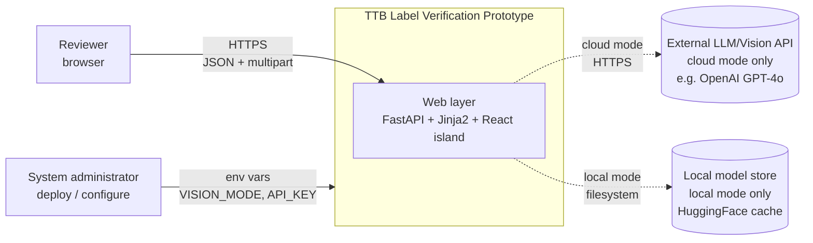
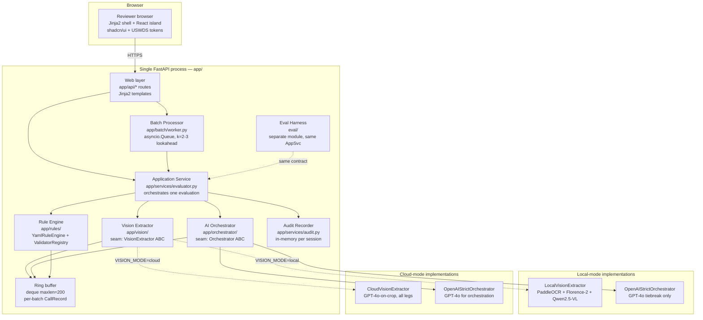
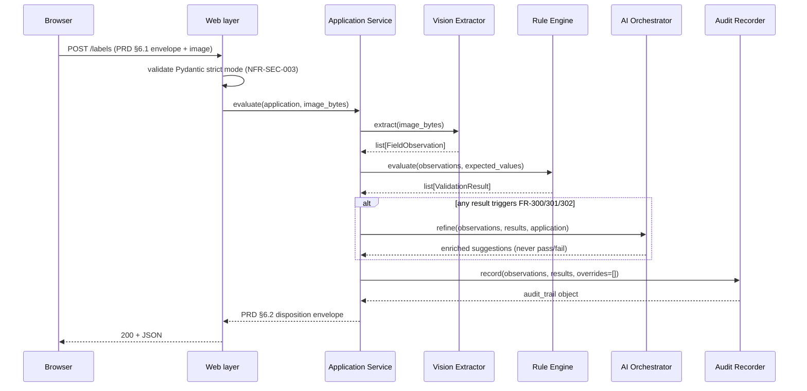
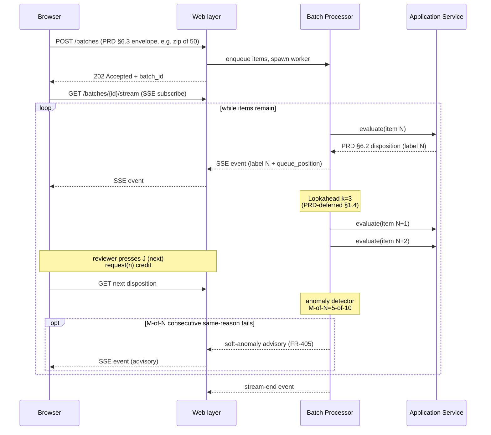

# ARCHITECTURE.md — Architecture Document
## TTB AI-Powered Alcohol Label Verification Prototype

**Document type:** Architecture Document (Arch Doc)
**Owner:** Project engineering team
**Audience (stated):** Take-home reviewer evaluating translation of functional requirements into a buildable design.
**Audience (simulated, write for this one):** A senior engineer joining the team and reading this to understand the codebase before opening the repo.
**Status:** Draft for review — prototype phase.
**Companion documents:** `BRD.md` (why), `PRD.md` v0.2 (what), `03-decisions.md` (decision log).
**Document version:** 0.3 (D-021 scope reduction; see §19.4 change log).

---

## 1. Document Control and Purpose

### 1.1 Purpose

This document specifies *how* the TTB AI-Powered Alcohol Label Verification prototype is built — its components, the interfaces between them, internal data models, technology choices, deployment topology, substitutability seams, and failure-recovery design. It is read by an engineer joining the team who wants to understand the codebase before opening the repo, and by a take-home reviewer evaluating whether the candidate translated functional requirements into a buildable design.

It sits between the PRD (which states externally observable behavior, FRs, and wire-format data contracts) and the running code. Every component documented here exists to serve at least one PRD FR; every interface materializes at least one PRD §6 wire contract; every ADR cited or authored here resolves a buildable trade-off the PRD did not pre-decide.

### 1.2 Document seam

The three-document layering is strict:

- **BRD owns:** business problem, stakeholders, value, scope envelope, compliance posture, BR-### business requirements.
- **PRD owns:** user roles, user journeys, FR-###/NFR-### externally observable behavior, system-boundary data contracts (PRD §6.1, §6.2, §6.3, §6.4), acceptance criteria, evaluation plan, demo plan.
- **Arch Doc owns:** components, interfaces between components, internal data models, technology choices, deployment topology, substitutability seams, failure-recovery design, ADRs.

**The PRD wins ties.** Where research outputs disagree with the PRD, this document follows the PRD and notes the conflict. Where this document would contradict a PRD FR, that is an Arch Doc bug — it routes back to S8 for revision, not back to the PRD.

### 1.3 Out of scope for this document

This document does **not** cover:

- The business case, stakeholder analysis, cost-benefit material — upstream in `BRD.md`.
- User-facing behavior, wire-format contracts, acceptance criteria, evaluation targets, demo plan — upstream in `PRD.md` v0.2.
- The README — a downstream deliverable.
- The rule pack itself (`rules/*.yaml`) — a delivered configuration artifact, referenced by the §6 RuleSet model but not authored here (S5 owns it).
- The demo runbook (`DEMO-RUNBOOK.md`) — referenced by §14, content delivered separately per `PRD-deferred-content.md` §3.4.
- The eval-harness configuration files (`eval/manifest.jsonl`, `eval/datasheet.md`) — referenced by §13, authored as eval-harness deliverables.
- Vendor evaluation. D-013 through D-016 settled the stack; this document lifts those decisions and does not reopen the alternatives.

### 1.4 Reading order

An engineer joining the team should read §2 (principles) → §3 (system context) → §4 (component decomposition) → §9 (deployment) → §14 (local development setup), in that order, to be productive against the codebase. §6 (data models), §10 (failure modes), §11 (performance) are reference material for the surfaces that engineer will touch first. §15 (ADRs) and §17 (traceability) are the audit anchors.

A reviewer evaluating the design should read §2, §3, §4, §8 (substitutability seams), §10, §15.

### 1.5 PRD-deferred-content consumption

`PRD-deferred-content.md` is the head-start input for this document; each item below is absorbed into the section indicated and marked **[consumed]** at the point of absorption.

| `PRD-deferred-content.md` section | Item | Absorbed into |
|---|---|---|
| §1.1 | Confidence aggregation algorithm (min) | §6.3 (ValidationResult) + ADR D-017 (§15) |
| §1.2 | Cross-session determinism mechanism (canonicalized cache) | §6.7 + §10 |
| §1.3 | Audit-trail per-rule duration field split | ADR D-018 (§15) |
| §1.4 | Lookahead window default (`LOOKAHEAD_K=3`) | §11.3 |
| §1.5 | Logging field schema (T3 §Q3.10 reproduced) | §13.1 |
| §2.1 | Trimmed eval-harness paths and env-flag names | §13.4 + ADR D-019 (§15) |
| §2.2 | Eval manifest format (S4) | §4.9 + §13.4 |
| §3.1 | Pre-warm `/healthz` specifics | §3.2 + §10 cross-cutting |
| §3.2 | Cache strategy specifics + `scripts/regenerate_fixtures.py` | §10 + ADR D-020 (§15) |
| §3.3 | Stage-2 narration update (STONE'S THROW) | §14 (DEMO-RUNBOOK pointer) |
| §3.4 | Demo runbook structure | §14 (DEMO-RUNBOOK pointer) |

By the time §19 closes, every numbered item in `PRD-deferred-content.md` has a concrete home in this document.

---

## 2. Architecture Principles

Five principles govern every design decision. Each cites the source decision; each forbids something concrete; each is testable against the codebase.

**P1 — Deterministic core, AI orchestrates.** Rule evaluation runs in deterministic Python against a YAML-loaded RuleSet; AI orchestration only disambiguates borderline cases, paraphrases template reasoning, and reconciles OCR multi-reads. *Forbids:* the AI orchestrator deciding pass/fail, flipping a rule-engine `fail` to `pass`, or generating CFR citations. *Source:* D-002; PRD FR-303.

**P2 — Substitutability at the inference seam.** Every external dependency that does inference (vision extraction, LLM orchestration) sits behind a project-owned abstract interface (Python ABC or `Protocol`); two or more concrete implementations exist for each seam, and the runtime selects between them by environment variable. *Forbids:* hard imports of `openai` / `anthropic` / `transformers` outside the seam directory; inline LLM calls inside rule-engine code. *Source:* D-004; PRD NFR-PORT-001 / NFR-PORT-002.

**P3 — Rules as data.** The rule pack is canonical YAML under `rules/`, loaded into a Pydantic v2 `RuleSet` at startup; irregular checks reference Python validators *by name* from a `rules/_validators/` registry. *Forbids:* embedding rule logic in component code; hard-coding CFR citations in Python; loading rules from a database in MVP. *Source:* D-014; D-005; PRD §5.3.

**P4 — Honest failure modes.** Engine failures emit `needs_review` with a structured reason code from the T3 §Q3.10 taxonomy; the system never silently degrades to `pass`. *Forbids:* swallowed exceptions inside validators; default-pass on missing input; unstructured error messages to the reviewer. *Source:* D-007; PRD FR-900 series; T3 §Q3.10.

**P5 — State is session-scoped.** All in-flight state (batches, evaluations, audit records, ring buffers, the canonicalized cache) lives in process memory keyed by session; nothing persists beyond the FastAPI process lifetime. *Forbids:* database connections, Redis/Celery dependencies, file writes outside `eval/history/` (eval-only, gated by `DEV_MODE`), cross-session caches, durable workflow primitives. *Source:* PRD NFR-DATA-001 / NFR-DATA-002; BRD §8.4 prototype-tier compliance; T6 §Q6.6 "re-upload on crash" recovery contract.

(A directory-legibility convention — `base.py` next to `local.py` / `cloud.py` / `openai_strict.py` so substitutability is visible at the directory level — is followed throughout per S3 §4 / D-013 consequences, but it is a coding convention, not a principle that forbids a class of future decisions.)

---

## 3. System Context and External Interfaces

### 3.1 C4 Level 1 — System context



The prototype is a single-process FastAPI application reachable from a browser. Two external dependencies are mutually exclusive at runtime, selected by the `VISION_MODE` environment variable (D-015): in cloud mode, the system makes outbound HTTPS calls to a configured LLM/vision API; in local mode, it loads HuggingFace Transformers models from a local cache and makes no outbound calls.

There is **no** integration with COLAs Online, no production database, no persistent file store outside the eval-harness `eval/history/` directory, and no identity federation. The reviewer arrives via a public-readable URL (PRD OQ-2 prototype-tier resolution); the operator configures secrets and the deployment mode at process start (PRD NFR-SEC-002).

### 3.2 External interfaces (HTTP)

The system exposes the following endpoints. Each request shape points at the PRD §6 wire contract; each response shape reuses the PRD §6.2 disposition envelope or the §6.4 error contract.

| Method | Path | Request | Response | PRD FR |
|---|---|---|---|---|
| `POST` | `/labels` | Single-label envelope (PRD §6.1 application JSON + multipart label image) | PRD §6.2 disposition object | FR-100, FR-700–704 |
| `POST` | `/batches` | PRD §6.3 batch envelope (zip or multi-file) | `202 Accepted` + `batch_id`; results stream via SSE | FR-103, FR-400–406 |
| `GET` | `/batches/{batch_id}/stream` | — (SSE subscription) | Stream of PRD §6.2 objects augmented with `queue_position` and `batch_id` | FR-402, FR-406 |
| `GET` | `/batches/{batch_id}` | — | Current batch state + per-label disposition list | FR-406 |
| `GET` | `/batches/{batch_id}/labels/{label_id}/calls` | — | Per-batch ring-buffer record list (audit/dev) | FR-508 |
| `POST` | `/labels/{evaluation_id}/overrides` | Override record (reason_code, optional justification) | Updated audit-trail entry | FR-800–804 |
| `GET` | `/healthz` | — | `200` after model load + sentinel pipeline run | (operational; supports demo per PRD §10.3) |
| `GET` | `/eval` | — | HTML dashboard (gated by `DEV_MODE`) | (eval-harness; PRD §9.4) |
| `GET` | `/static/...` | — | Static assets (built React island, USWDS tokens) | FR-500 series |

`/healthz` is the **pre-warm** endpoint: it loads vision models and the LLM client, exercises the full pipeline against fixture-01 as a sentinel, and returns 200 within 2 seconds on a warm system. The demo runbook invokes `/healthz` at T-5 minutes pre-recording (per `PRD-deferred-content.md` §3.1 **[consumed]**).

`/eval` is registered only when `DEV_MODE` evaluates truthy at process start; in production-trajectory deployment the route is not registered (per `PRD-deferred-content.md` §2.1 **[consumed]**; ADR D-019).

The error contract for every endpoint is PRD §6.4: `{error_kind, reason_code, message, details}` with `error_kind ∈ {rejected_input, engine_failure, partial_completion}`.

### 3.3 What the system does *not* expose

- **No public write API** for the rule pack. Rules are loaded from `rules/*.yaml` at process start; reload requires a deploy.
- **No admin API.** Configuration changes are env-var-only and require a process restart.
- **No outbound calls in local mode.** The cloud-mode whitelist is the single configured LLM endpoint. Documented for federal-context review per PRD NFR-SEC-001.
- **No persistence API.** `NFR-DATA-001` and `NFR-DATA-002` are enforced structurally — there is no DB connection, no file write outside `eval/history/`.

---

## 4. Component Decomposition

### 4.1 C4 Level 2 — Component diagram



### 4.2 Components

The components below are listed in the order an evaluation flows through them. Each entry: responsibility, dependencies, substitutability posture, failure mode reference.

#### 4.2.1 Web layer (`app/api/`, `app/ui/`)

**Responsibility.** Terminate HTTPS; parse and validate inbound JSON envelopes against the PRD §6.1 application schema using Pydantic v2 strict-mode (NFR-SEC-003); render Jinja2 page shells; serve the pre-built React island from `app/ui/static/island/`; mount the SSE endpoint for batch streaming.

**Dependencies.** Calls Application Service for single-label evaluations; calls Batch Processor for batch submissions. Reads `app.state.batches` for batch-table rendering. Writes nothing outside the request/response cycle.

**Substitutability.** Not substitutable — FastAPI + Jinja2 is the chosen stack per D-013; the front-end React island is the chosen rendering layer per D-013.

**Failure mode.** Malformed input → returns PRD §6.4 `rejected_input` error with `400` status. No silent fallback; FR-101 / FR-102 enforced at this layer.

**Note on the React island.** The built bundle (`app/ui/static/island/`) is committed to the repo; reviewers running `uv sync && uv run task demo` do not need Node. Frontend developers regenerate the island with `cd frontend && pnpm dev` (per D-013 consequences).

#### 4.2.2 Application Service (`app/services/evaluator.py`)

**Responsibility.** Orchestrates a single evaluation end-to-end: (1) takes the wire-format input from the Web layer; (2) invokes the Vision Extractor against the label image(s); (3) invokes the Rule Engine with the extracted observations and the application-derived `ExpectedValue`s; (4) invokes the AI Orchestrator only for the three task triggers (FR-300, FR-301, FR-302); (5) calls the Audit Recorder; (6) assembles the PRD §6.2 disposition envelope and returns it to the Web layer.

**Dependencies.** Vision Extractor, Rule Engine, AI Orchestrator, Audit Recorder. Reads the loaded `RuleSet` (via DI). Holds no per-evaluation state beyond the call frame.

**Substitutability.** Not substitutable — this is the project-owned glue between substitutable seams. Tested by mocking each downstream seam.

**Failure mode.** On any downstream component raising, the Application Service catches the exception, emits the appropriate FR-900-series reason code, and assembles a `needs_review` disposition with that reason code populated. **Never re-raises to the Web layer except for genuine programmer-error bugs.** This is the chokepoint where P4 (honest failure modes) is enforced.

#### 4.2.3 Vision Extractor (`app/vision/`) — Substitutability seam #1

**Responsibility.** Accepts a label image (bytes + content-type + optional dimensions) and returns a list of `FieldObservation` objects (T3 §Q3.2 input contract; PRD §5.1 FR-001–008). Each observation includes raw and normalized text, optional numeric value, OCR confidence, bounding box, alternative candidate reads, font attributes, and an image URI for evidence packaging.

**Dependencies.** None inside the project. Concrete implementations call out: the local implementation invokes PaddleOCR PP-OCRv5 (GPU) and GPT-4o-on-crop as strict-mode tiebreaker (per D-021 prototype-tier scope reduction — Florence-2 and Qwen2.5-VL skeletons are dropped from MVP; the seam is preserved for future re-introduction); the cloud implementation invokes GPT-4o-on-crop with Structured Outputs `strict:true` for every leg.

**Substitutability.** **Yes (D-004 swap point #1).** The abstract `VisionExtractor` (a Python `Protocol`) lives at `app/vision/base.py`; concrete implementations at `app/vision/local.py` and `app/vision/cloud.py`. Selection is by `VISION_MODE={local,cloud,auto}` — `auto` probes for a CUDA device and falls back to cloud (D-015).

**Failure mode.** Returns `disposition=needs_better_photo` with structured reason from the T4 §Q4.6 taxonomy (`WARNING.LEGIBILITY.LOW_RESOLUTION`, `WARNING.LEGIBILITY.GLARE`, etc.) when image quality fails the BRISQUE/NIQE gates. Returns `disposition=engine_failure` with `ENGINE.MODEL.UNAVAILABLE` (FR-912) on upstream API outage in cloud mode, on missing model weights in local mode. Per-field DPI absence emits `ENGINE.MEASUREMENT.MISSING_DPI` (FR-910 / FR-602).

#### 4.2.4 Rule Engine (`app/rules/`)

**Responsibility.** Loads the `RuleSet` from YAML at process start (D-014); evaluates rules against `FieldObservation` + `ExpectedValue` per the T3 §Q3.2 contract; produces `ValidationResult` objects with disposition (`pass | fail | needs_review | not_applicable`), reason code, CFR citation, evidence, and confidence per S5 §c.

**Dependencies.** Validator Registry (4.2.5); the loaded `RuleSet` (immutable after startup); the loaded `reason_codes` registry (S5 §e). No I/O during evaluation except reading from the immutable rule and registry structures.

**Substitutability.** The `RuleEngine` ABC at `app/rules/engine.py` permits a swap, but the only shipped implementation is `YamlRuleEngine` at `app/rules/yaml_engine.py`. Alternative engines (Drools, OPA, pure-Pydantic) were explicitly rejected per D-014 alternatives and are not shipped.

**Failure mode.** Per-rule timeouts (250 ms budget per S5 §13) emit `ENGINE.VALIDATOR.TIMEOUT` (FR-908). Validator exceptions emit `ENGINE.VALIDATOR.EXCEPTION` (FR-907). Whole-evaluation timeout (5 s SLA exhausted) emits `ENGINE.SLA.TIMEOUT` (FR-909) and returns whatever partial results have been computed. The full failure-mode taxonomy is reproduced in §10.

#### 4.2.5 Validator Registry (`app/rules/_validators/`)

**Responsibility.** A Python registry mapping validator names (e.g., `equality_match`, `cpi_lookup`, `abv_band`, `verbatim_hash`, `fuzzy_brand`) to callables with the signature `Callable[[FieldObservation, ExpectedValue, ValidatorContext], ValidationResult]`. Rules in YAML reference validators by name (per D-014); the registry resolves the name to a callable at engine load.

**Dependencies.** None — pure Python. Imported by `YamlRuleEngine` at startup; no runtime imports.

**Substitutability.** The registry pattern itself is the substitutability mechanism. Adding a new validator is: (a) write a Python function with the correct signature; (b) register it under a stable name; (c) reference the name from YAML. No engine changes.

**Failure mode.** A YAML rule referencing an unknown validator name fails the RuleLoader's whitelist check (S5 §d) at startup; the engine refuses to start. This is fail-closed by construction (P4); the failure surfaces at deploy time, not at request time.

#### 4.2.6 AI Orchestrator (`app/orchestrator/`) — Substitutability seam #2

**Responsibility.** Performs the three MVP tasks from T5: brand-name borderline disambiguation (FR-300), reasoning-text enrichment (FR-301), OCR multi-reading reconciliation (FR-302). Each task is a single-shot, structured-output, schema-strict tool call (T5 §Recommendation #1). The orchestrator **never** decides pass/fail (D-002; FR-303).

**Dependencies.** Called from the Application Service when, and only when, a Rule Engine result triggers one of the three task conditions. Records every prompt/response into the per-batch ring buffer (S3 Q14).

**Substitutability.** **Yes (D-004 swap point #2).** The abstract `Orchestrator` (an ABC with one async method `refine`) lives at `app/orchestrator/base.py`. Two implementations ship in MVP per D-021 prototype-tier scope reduction:
- `OpenAIStrictOrchestrator` (`openai_strict.py`) — **default in MVP; the only implementation validated against the demo fixtures and eval corpus.** OpenAI Structured Outputs `strict:true`, `temperature=0`, fixed seed, snapshot-pinned model.
- `AnthropicStrictOrchestrator` (`anthropic_strict.py`) — **swap-path skeleton.** Declares the seam; exercises Anthropic `tool_use` strict mode in unit tests; **not** validated against the demo fixtures or the eval corpus in MVP.

The Anthropic skeleton exists to demonstrate the seam holds — it proves provider-agnostic substitutability without claiming production-readiness for a backend the prototype does not exercise. A `VllmXgrammarOrchestrator` was scoped out per D-021 (production-trajectory federal on-prem); the existing ABC permits future re-introduction without rework.

**Failure mode.** When the LLM endpoint is unreachable, returns `needs_review` with `ENGINE.MODEL.UNAVAILABLE` (FR-304 / FR-912). When the structured response fails schema validation after one retry, returns `needs_review` with a `LLM_OUTPUT_INVALID` qualifier on the task-specific reason code (T5 Task 1 / 2 / 3 malformed-output behavior). Manual review (FR-802) is preserved against the Rule Engine output alone — the Application Service's assembly does not require a successful orchestrator call.

#### 4.2.7 Batch Processor (`app/batch/`)

**Responsibility.** Implements the pull-based, reactive-streams-style batch flow per T6: consumes the batch envelope; spawns the asyncio.Queue-backed lookahead worker (k=2–3 per FR-402; default `LOOKAHEAD_K=3` per `PRD-deferred-content.md` §1.4 **[consumed]**); enforces `request(n)` demand semantics from the reviewer cadence (NFR-PERF-002); runs the soft-anomaly detector for the M-of-N consecutive-fail prompt (FR-405); preserves mid-batch independence under the override semantics (FR-404).

**Dependencies.** Application Service (one call per item). Holds the in-memory `BatchInFlightState` (T6 §Q6.6) for the duration of the session. Streams results out via SSE.

**Substitutability.** Not substitutable in MVP. The pull-based pattern, the in-process FIFO, and the asyncio-single-worker concurrency model are the chosen primitives. T6 §Q6.7 documents the production swap path (Kafka consumer groups; RabbitMQ `prefetch=1`); the prototype's `agent_id`-aware interfaces preserve the seam (per T6 recommendation).

**Failure mode.** Per-item failures route through the Application Service (so each item gets the standard `needs_review` + reason code path). Browser network loss mid-batch: the reviewer's queue position is held by the SSE reconnect contract; on full process restart, the batch is lost and the reviewer re-uploads (T6 §Q6.6 recovery contract; documented in §14 runbook).

#### 4.2.8 Audit Recorder (`app/services/audit.py`)

**Responsibility.** Assembles the audit-trail object per FR-703 / PRD §6.2: `evaluation_id`, `rule_set_version`, `model_version`, `prompt_version`, `input_hash`, `output_hash`, `started_at`, `completed_at`, `per_rule_trace`, `overrides`. Populates the trace from the Rule Engine's per-rule results (rule_id, disposition, evidence_ref) and from the Web layer's override-recording endpoint (FR-801).

**Dependencies.** Receives data from the Application Service after the evaluation completes. In-memory only per NFR-DATA-002; held inside the per-session state, evicted when the session ends.

**Substitutability.** The boundary is designed so a persistence-backed audit recorder can be substituted later without changing the Application Service contract (this is OQ-ARCH-4 in §16). MVP ships the in-memory implementation only.

**Failure mode.** Audit assembly cannot fail without the upstream evaluation having already failed; if it does (e.g., serialization error), the Application Service emits `ENGINE.VALIDATOR.EXCEPTION` against the audit-recorder rule and the disposition still ships with whatever audit fields completed.

#### 4.2.9 Eval Harness (`eval/`)

**Responsibility.** A separate module that consumes the same Application Service contract, runs against `eval/manifest.jsonl` (per `PRD-deferred-content.md` §2.2 **[consumed]**), and produces metrics: disposition macro-F1, per-rule precision/recall, per-class small-multiples, calibration curve, time-to-disposition distribution (PRD §9.2). Persists per-run metrics to `eval/history/` (timestamped JSON) and renders the `/eval` dashboard route.

**Dependencies.** Application Service. Reads `eval/manifest.jsonl` and the rule-pack/reason-codes registry. Writes to `eval/history/` (the only sanctioned filesystem write outside session memory).

**Substitutability.** Standalone module; not part of the request-handling path. Compiled out of production builds when `DEV_MODE` is falsy (per ADR D-019).

**Failure mode.** Eval runs are CI-triggered or manually triggered; failures surface as CI errors, not user-facing failures. Path-level errors (missing fixture, missing manifest entry) fail loudly.

---

## 5. Data Flow

### 5.1 Single-label flow



**Time-budget allocation per T3 §Q3.9.3 (5 s SLA, p50 / p99):**

| Step | p50 | p99 | Serves |
|---|---|---|---|
| Web layer ingest + Pydantic validation | 100 ms | 300 ms | FR-100, FR-101 |
| Vision Extractor | 1500 ms | 2800 ms | FR-001–008 |
| Rule Engine | 150 ms | 300 ms | FR-200–240 (engine slice 100–300 ms per T3 §Q3.9) |
| AI Orchestrator (when invoked, batched single call) | 800 ms | 1500 ms | FR-300–304 |
| Reasoning + audit assembly | 80 ms | 200 ms | FR-700–704 |
| Response serialization | 70 ms | 150 ms | — |
| **Total** | **~2.7 s** | **~5.0 s** | NFR-PERF-001, NFR-PERF-003 |

The orchestrator slice is conditional — most evaluations (clean fixture-01-style happy paths) skip it entirely. The 5 s p99 is the SLA ceiling, not the design target; the design target is p50 ≤ 2.7 s (NFR-PERF-003 acceptance).

### 5.2 Batch flow



**First label of a batch (FR-401)** is processed individually under NFR-PERF-001 — the Batch Processor does *not* wait to fill the lookahead window before responding on item 1. This is the explicit AC-FR-401 acceptance criterion.

**Pull-based demand (NFR-PERF-002, FR-403)** is enforced by the SSE consumer: the `request(n)` semantics map to the browser's `EventSource` reconnect/backpressure behavior. The producer (Batch Processor) does not enqueue beyond outstanding consumer demand. The asyncio.Queue inside the worker is bounded (`maxsize=k+1`).

**Mid-batch override (FR-404)** does not stop the worker. The independence assumption (T6 §Q6.5) is the default; the soft-anomaly detector (FR-405) fires the advisory when M-of-N consecutive labels in the rolling window fail with the same reason code (M=5, N=10 starter rule per T6).

**Browser network loss mid-batch.** The reviewer's queue position is preserved server-side in `app.state.batches[batch_id]`. Browser `EventSource` auto-reconnects; on reconnect, the SSE handler resumes from the last delivered `queue_position`. Full process restart is the documented loss boundary (T6 §Q6.6 "re-upload on crash" recovery contract; §14 runbook).

### 5.3 Pre-warm flow (`/healthz`)

The pre-warm contract (per `PRD-deferred-content.md` §3.1 **[consumed]**): on first invocation, `GET /healthz` triggers `VisionExtractor.ensure_loaded()` (model load — `LocalVisionExtractor` reads weights into the CUDA context; `CloudVisionExtractor` opens the HTTP client and validates the API key), `RuleLoader.load()` (YAML parse + Pydantic validate + reason-code registry cross-check + asset hash verify; fail-closed per §10.1 row 7), and `Orchestrator.ensure_client()` (opens the LLM HTTP client). It then runs the full extraction → rule-engine → orchestrator pipeline against fixture-01 as a sentinel and returns `200 OK`. The demo runbook hits `/healthz` at T-5 minutes pre-recording; subsequent calls return within 2 seconds on a warm system. Cold-start on the GPU path is ~30–45 s for model loads (D-016 consequences); cold-start on cloud mode is ~1 s. Subsequent requests skip the load path; per-request latency thereafter is governed by §11.

---

## 6. Internal Data Models

The PRD owns wire-format contracts at the system boundary (PRD §6.1, §6.2, §6.3, §6.4). This section documents only the **internal** types — Pydantic v2 models that move between components inside the process. Wire models are deliberately not redrawn here; the Web layer translates between wire and internal types in `app/api/`.

All models below set `model_config = ConfigDict(extra="forbid", frozen=True)` per S5 §9 — strict, immutable, fail-loud, audit-friendly.

### 6.1 `FieldObservation` — Vision Extractor output

**Purpose.** What the Vision Extractor produces for one extracted field on one label image. Source: T3 §Q3.2 input contract; refined by S5 §c.

**Fields:**
- `field_id: str` — canonical name (e.g., `brand`, `alcohol`, `warning_block`, `government_warning_text`).
- `beverage_class: BeverageClass` — `wine | spirits | malt`.
- `observed_value: Any | None` — the extracted scalar (string, Decimal, dict for structured fields).
- `evidence: tuple[Evidence, ...]` — one or more evidence rows; see §6.2.
- `timestamp_ms: int | None` — when the observation was produced.
- `upstream_meta: dict[str, Any]` — engine version, model snapshot, processing-ms.

**Lifecycle.** Created by the Vision Extractor on each call to `extract()`; consumed by the Rule Engine; included by reference in the audit trail. Discarded at session end with the rest of the in-memory state (NFR-DATA-001).

**Serves:** FR-001 through FR-008 (extraction); FR-602 (DPI metadata routing); FR-603 (needs-better-photo).

### 6.2 `Evidence` — UI-facing evidence row

**Purpose.** A single piece of evidence supporting (or contradicting) a rule outcome; consumed by the C-EvidencePanel UI (T8 stage 3).

**Fields:**
- `field_id: str`, `source: EvidenceSource ∈ {ocr, layout, classifier, derived, metadata}`.
- `page_id: str | None`, `panel: str | None` — `front | back | neck | wrap | side`.
- `image_uri: str | None`, `bbox: tuple[int,int,int,int] | None` — pixel-space coords.
- `extracted_text: str | None`, `normalized_text: str | None`.
- `matched_against_value: str | None` — the `ExpectedValue` compared.
- `match_kind: MatchKind ∈ {exact, normalized, fuzzy, hash, numeric_band, lookup, regex, layout, none}`.
- `match_score: float | None ∈ [0,1]` — for fuzzy / lookup.
- `confidence: float ∈ [0,1]`.
- `notes: str | None` — engine breadcrumb.

**Lifecycle.** Created during extraction or rule evaluation; aggregated into `ValidationResult.evidence` and `FieldObservation.evidence`. Frozen so it can be cached and shared across the audit trail (S5 §9).

**Serves:** FR-501 (bbox overlay); FR-502 (evidence panel); FR-701 (per-field finding shape).

### 6.3 `ExpectedValue` — Application-derived reference value

**Purpose.** What the application JSON says should be on the label; the Rule Engine compares `FieldObservation` against this. Source: T3 §Q3.2; S5 §c.

**Fields:**
- `field_id: str`, `value: Any | None` — canonical expected scalar.
- `aliases: tuple[str, ...]` — acceptable alternate forms (e.g., `["STONE'S THROW", "Stone's Throw"]`).
- `abv_labeled_pct: Decimal | None`, `abv_actual_pct: Decimal | None` — for ABV rules.
- `container_volume_ml: Decimal | None` — for §16.22(b) and §16.22(a)(4).
- `parameters: dict[str, Any]` — rule-specific (e.g., `{ "is_import": true }`).
- `source_cola: str | None` — application reference id.

**Lifecycle.** Constructed by the Application Service from the inbound application envelope (PRD §6.1) on each evaluation; held only for the call frame.

**Serves:** Every FR-200-series rule evaluation.

### 6.4 `ValidationResult` — Rule Engine output

**Purpose.** The single, immutable outcome of evaluating one rule on one application + one label. Source: T3 §Q3.2 output contract; S5 §c.

**Fields:**
- `rule_id: str` — stable identifier (e.g., `common.warning.heading_caps_bold`).
- `cfr_citation: str` — e.g., `"27 CFR §16.22(a)(2)"`.
- `beverage_class: BeverageClass`.
- `outcome: Outcome ∈ {pass, fail, insufficient_evidence, not_applicable, timeout, error}`.
- `severity: Severity ∈ {reject, warn, info}`.
- `reason_code: ReasonCode | None` — `BIN.SUB.SPECIFIC[.QUALIFIER]` per FR-702; required when `outcome=FAIL`.
- `aggregated_confidence: float ∈ [0,1]` — **min** over evidence confidences (per S5 §11; ADR D-017).
- `evidence: tuple[Evidence, ...]`, `expected: ExpectedValue | None`, `observed: FieldObservation | None`.
- `message: str | None` — human-readable explanation, rendered from a template.
- `engine_meta: EngineMeta` — engine_version, rule_pack_version, rule_pack, started_at_ms, elapsed_ms.

**Lifecycle.** Created by the validator callable; bubbled up through the Rule Engine; included in the disposition envelope and the audit trail. Frozen.

**Serves:** FR-700, FR-701, FR-702, FR-703, FR-704.

### 6.5 Reason codes — grammar and registry

**Purpose.** The codified reason every negative disposition carries. Source: T3 §Q3.6.1 (model `RejectionReason`); PRD FR-702.

**Note on naming.** T3 §Q3.6.1 originally proposed a stand-alone `RejectionReason` Pydantic model carrying `bin`, `severity`, `disposition`, `field`, `cfr`, `evidence`, etc. Per S5 §c, those concerns were absorbed into `ValidationResult` (§6.4) so that *every* result — pass, fail, or needs-review — flows through the same shape; only the `reason_code: ReasonCode | None` field survives as a stand-alone construct. There is no `RejectionReason` class in MVP code.

**Grammar:** `BIN.SUB.SPECIFIC[.QUALIFIER]`, validated by the regex `^[A-Z][A-Z0-9_]*(?:\.[A-Z][A-Z0-9_]*){2,3}$`.

**Bins (PRD FR-702):** `BRAND`, `CLASS_TYPE`, `ALCOHOL_CONTENT`, `NAME_ADDRESS`, `NET_CONTENTS`, `WARNING`, `ALLERGEN`, `LEGIBILITY`, `ENGINE`.

**Construction.** Reason codes are not constructed at runtime — they are looked up by name in the `reason_codes.yaml` registry (S5 §e). A `ValidationResult.reason_code` value not present in the registry causes the RuleLoader to refuse startup (S5 §d cross-check 5(c); fail-closed). A reason code present in the registry but unreferenced by any rule loads cleanly but emits a warning at startup (orphan-code detection).

**Serves:** FR-702, FR-300–FR-304 (where AI tasks emit qualifiers like `LLM_OUTPUT_INVALID`), FR-900 series.

### 6.6 `RuleSet` and `RuleDefinition` — in-memory rule pack

**Purpose.** The Pydantic v2 representation of the YAML rule pack after RuleLoader validation. Source: D-014; S5 §c, §d.

**`RuleSet`** (top-level):
- `version: str` — semver (e.g., `"0.1.0"`); pinned to engine-supported range at load (S5 §d cross-check 5(h)).
- `effective_date: str` — ISO-8601.
- `rules: tuple[RuleDefinition, ...]` — frozen, sorted by `rule_id`.
- `reason_codes: dict[str, ReasonCodeEntry]` — loaded from `reason_codes.yaml`.
- `assets: dict[str, AssetRef]` — including the §16.21 verbatim warning text, hash-pinned (S5 §4).
- `decision_tables: dict[str, DecisionTable]` — including the §16.22(a)(4) cardinal cpi table, `interpolation: none` (S5 §b).

**`RuleDefinition`** (one rule):
- `rule_id: str`, `cfr_citation: str`.
- `applies_to_classes: tuple[BeverageClass, ...]`.
- `reason_code: ReasonCode`, `severity: Severity`.
- `match_policy: str` — declared in YAML (D-005).
- `validator: str` — name resolved against the Validator Registry whitelist (S5 §d).
- `evidence_required: tuple[str, ...]`.
- `confidence_floor: float ∈ [0,1]` — default 0.5.
- `parameters: dict[str, Any]`, `tolerance: dict | None`, `decision_table: dict | None`, `decision_table_ref: str | None`, `asset: dict | None`.
- `effective_date: str`, `supersedes: tuple[str, ...]`.
- `rule_pack_version: str | None`, `rule_pack: str | None` — injected from pack header.
- `test_fixtures: tuple[str, ...]` — at least one required (fail-closed if empty per S5 §d).
- `disabled: bool = False`, `notes: str | None`.

**Lifecycle.** Built once at process start by the RuleLoader (`app/rules/loader.py`); held immutable in `app.state.ruleset`; never mutated. Reload requires a process restart. Source-of-truth files: `rules/common/*.yaml`, `rules/wine/*.yaml`, `rules/spirits/*.yaml`, `rules/malt/*.yaml`, `rules/spirits-deep.yaml`, `rules/reason_codes.yaml`, `rules/tables/cpi_16_22_a_4.yaml`, `assets/warnings/govt_warning_16_21.txt`.

**Disabled rules.** A rule with `disabled: true` is loaded and validated by the RuleLoader (still subject to schema, registry, and fixture-presence checks) but never invoked at evaluation time. Used for staged rollout: a new rule lands committed-but-disabled, the eval harness exercises it against fixtures while the rest of the pack runs in production, and a follow-up commit flips the flag to enable it. Per S5 §6.

**Sample rule (illustrative; the canonical pack lives under `rules/`):**

```yaml
# rules/spirits/spirits.yaml (excerpt)
rule_pack: spirits
rule_pack_version: "0.1.0"
rules:
  - rule_id: spirits.alcohol.tolerance_band
    cfr_citation: "27 CFR §5.65(c)"
    applies_to_classes: [spirits]
    reason_code: ALCOHOL_CONTENT.TOLERANCE.OUT_OF_BAND
    severity: reject
    match_policy: tolerance
    validator: abv_band
    evidence_required: [abv]
    parameters:
      tolerance_pp: 0.3
      arithmetic: decimal
    effective_date: "2022-02-09"   # T.D. TTB-176
    test_fixtures:
      - F-SPIRITS-ALC-36-PASS-01
      - F-SPIRITS-ALC-36-FAIL-LOW-01
      - F-SPIRITS-ALC-36-FAIL-HIGH-01
    disabled: false
```

The full rule-pack content lives in S5 §a (~1100 lines of YAML across the four packs); this document references the shape, not the contents.

**Serves:** Every FR-200-series rule.

### 6.7 `BatchInFlightState` and `BatchItem` — Batch Processor state

**Purpose.** Session-scoped state for an in-progress batch. Source: T6 §Q6.6.

**`BatchItem`** (per-label state machine):
- States: `queued → processing → ready → presented → reviewed → disposed`, with a side-edge to `failed(reason)`.
- Fields: `label_id: str`, `application_ref: str`, `state: ItemState`, `result: DispositionEnvelope | None`, `enqueued_at: datetime`.

**`BatchInFlightState`**:
- `batch_id: str` (UUID4).
- `agent_id: str` — single value in MVP, structurally present per FR-403/T6 §Q6.7.
- `items: list[BatchItem]` — in submission order.
- `current_index: int` — reviewer's current position.
- `lookahead_k: int` — defaults to 3, configurable per `PRD-deferred-content.md` §1.4.
- `recent_dispositions: deque[ReasonCode | None]` — sliding window of length 10 for the M-of-N anomaly detector.
- `calls: deque[CallRecord]` — `maxlen=200`, the per-batch ring buffer (S3 Q14) feeding `C-RawJSONDrawer` via `GET /batches/{id}/labels/{lid}/calls`.

**Lifecycle.** Created on `POST /batches`; held in `app.state.batches[batch_id]`; evicted on session end (no persistence per NFR-DATA-001/002).

**Serves:** FR-400 through FR-406; FR-508 (raw-JSON drawer).

### 6.8 `AuditRecord` — in-memory audit trail

**Purpose.** The audit-trail object surfaced in PRD §6.2 `audit_trail`. Source: T3 §Q3.6.3.

**Fields (already specified in PRD §6.2 wire shape; this is the internal structure):**
- `evaluation_id: UUID`, `rule_set_version: str`, `model_version: str | None`, `prompt_version: str | None`.
- `input_hash: str` (sha256 of canonicalized application JSON + image bytes).
- `output_hash: str` (sha256 of the disposition envelope).
- `started_at: datetime`, `completed_at: datetime`.
- `per_rule_trace: list[PerRuleTraceEntry]` where each entry is `{rule_id, disposition, evidence_ref}`.
- `overrides: list[OverrideEntry]` — populated by the Web layer's `POST /labels/{evaluation_id}/overrides` endpoint.

**Note on `duration_ms`.** The PRD §6.2 wire example includes `audit_trail.per_rule_trace[].duration_ms`. Per `PRD-deferred-content.md` §1.3, this field is telemetry (operator-visible perf), not audit (regulatory reconstruction). Per ADR D-018 (§15), the architecture splits this: per-rule durations move to a separate `metrics` block on the disposition envelope; the audit trail keeps only audit-relevant fields. The Web layer assembles both blocks from the same `EngineMeta` source so no double-bookkeeping is required.

**Lifecycle.** Built by the Audit Recorder at the end of each evaluation; held in-memory inside `app.state.batches[batch_id].items[i].result.audit_trail`; evicted with the rest of the session state.

**Serves:** FR-703, FR-801, NFR-AUDIT-001, NFR-AUDIT-002.

### 6.9 `CallRecord` — per-LLM/vision-call ring-buffer entry

**Purpose.** The shape stored in the `BatchInFlightState.calls` ring buffer; surfaced through `C-RawJSONDrawer` (PRD FR-508). Source: S3 Q14.

**Fields:**
- `ts: datetime`, `batch_id: str`, `label_id: str`.
- `stage: Literal["vision.paddleocr", "vision.swt", "vision.gpt4o_tiebreak", "rule.evaluate", "orch.brand_disambig", "orch.reasoning_enrich", "orch.ocr_reconcile"]`.
- `request: dict` (full prompt / image-hash / params), `response: dict` (full structured output).
- `latency_ms: int`, `model: str | None`, `provider: str | None` (`"openai" | "anthropic" | "local.paddleocr"`).
- `prompt_version: str | None`, `output_hash: str`.

**Lifecycle.** Appended on every LLM/vision call; bounded to `maxlen=200` per batch (~2.4 MB at ~12 KB/record, OOM-safe per S3 Q14). Evicted on FIFO basis when the ring fills.

**Serves:** FR-508; NFR-OBS-001 (the per-call records are the structured-log substrate).

### 6.10 Reason-code registry (`reason_codes.yaml`)

The registry shape per S5 §e: a top-level `version` (semver), a `bins` mapping (BIN → human description), and a `codes` mapping (`BIN.SUB.SPECIFIC[.QUALIFIER]` → `{description, cfr_anchors, severity}`). Loaded by the RuleLoader at startup; cross-checked for the registry-completeness invariant (every `RuleDefinition.reason_code` must appear in the registry; failure refuses startup).

**Serves:** FR-702 (every reason code is a registry entry); supports the C-EvidencePanel hover-text catalog (T8 default-visible behavior).

### 6.11 Brand-name match policy

**Purpose.** PRD FR-240 specifies the *behavior* (case- or punctuation-only differences pass; substantive differences route to AI orchestration via FR-300) and explicitly delegates the algorithm and threshold values to this document and the rule pack. Source: T3 §Q3.4; S5 §5; D-005 (per-field policies); D-012 (brand-match staging).

**Algorithm (two-stage layered pipeline; lives in `app/rules/brand_match.py`):**

1. **Stage A — normalized exact.** Apply Unicode NFKC, casefold, strip punctuation, collapse whitespace, drop legal suffixes (`®`, `™`, `Inc.`, `Co.`, `LLC`, leading `The`). If the normalized expected and observed strings are equal, emit `match_kind: normalized`, disposition `pass`, confidence inherited from OCR. **This is where STONE'S THROW vs. Stone's Throw resolves cleanly without override** (per `PRD-deferred-content.md` §3.3 stage-2 narration update).
2. **Stage B — fuzzy fallback.** Compute Jaro-Winkler similarity on the normalized strings (RapidFuzz `token_set_ratio` is the alternative under T3 §Q3.4). Two thresholds govern the outcome:
   - score ≥ `pass_threshold` → emit `match_kind: fuzzy`, disposition `pass`, with `match_score` recorded in `Evidence` for the audit trail.
   - `needs_review_threshold` ≤ score < `pass_threshold` → emit disposition `needs_review`; this is the borderline band that triggers FR-300 (AI orchestration disambiguation).
   - score < `needs_review_threshold` → emit disposition `fail` with `BRAND.NAME.MISMATCH`.

**Thresholds.** The numeric thresholds are rule-pack data (D-014), not Arch-Doc data. The current MVP rule pack sets `pass_threshold: 0.92` and `needs_review_threshold: 0.85` (T3 §Q3.4 recommended starting values). Tuning is a rule-pack edit, not a code change. Threshold rationale: T3 §Q3.4 anchors 0.85 / 0.92 against RapidFuzz benchmarks on the cost-of-error-asymmetry framing (false-pass weighted higher than false-reject per T9 / T3 §Q3.4); S5 §5 confirms 0.85 as the lowest-defensible fuzzy floor.

**Where it slots in.** Stage A is fast (microseconds) and runs first. Stage B fires only when Stage A misses. The orchestrator (FR-300) is invoked by the Application Service only when Stage B emits `needs_review` — never for a Stage A pass, never for a Stage B fail outside the borderline band. This keeps the AI orchestrator's invocation rate bounded to genuinely ambiguous cases (per T5's "borderline-only" invocation discipline).

**Serves:** FR-240; FR-300 (orchestrator trigger condition); BR-001 + Dave-class skepticism mitigation per D-005, D-012.

---

## 7. Technology Stack and Rationale

The stack below is settled by D-013 through D-016 (S3) and S1 (vision stack survey). This section is a summary table — not a re-evaluation. Alternatives are listed only to anchor the choice; the rejection rationale is in the cited ADR.

| Layer | Choice | Decision | Rejected alternatives | Notes |
|---|---|---|---|---|
| Backend framework | **FastAPI** (ASGI, Pydantic v2 native) | D-013 | Flask, Django, FastHTML+HTMX, Streamlit, Gradio, Next.js | ASGI is required for streaming SSE and asyncio-based batch worker; Pydantic v2 is required for OpenAI Structured Outputs `strict:true` integration. |
| Frontend shell | **Jinja2** server-rendered page shells | D-013 | Pure SPA (Next.js), Streamlit, Gradio | Single Python process; no Node runtime in the deployed container. |
| Frontend island | **React + TypeScript + Vite + shadcn/ui** (Radix + Tailwind) | D-013 | Mantine, `@trussworks/react-uswds`, plain Tailwind | shadcn/ui is copy-paste so we own the source; Radix provides WAI-ARIA APG focus management for `C-BboxOverlay`, `C-OverrideDrawer`, `C-LiveRegion`. USWDS color tokens applied via a small CSS variable layer. |
| Bbox overlay | **SVG `<svg>` over ``** with `<g role="button" tabindex="0" aria-pressed>` per box | D-013 | Canvas, `react-image-annotate`, Konva | SVG is in the DOM and supports ARIA natively; Canvas content is "not part of the DOM except for fallback content"; Konva acknowledges its keyboard-accessibility gap. |
| Rule data | **Real YAML** under `rules/` + Pydantic v2 `RuleSet` model + Python validator registry | D-014 | Pydantic-only with stub YAML, JSON Schema files, Drools, OPA | Per-field match policies (D-005) are visible to a reviewer in one `cat` command. |
| Vision (cloud mode) | **GPT-4o-on-crop with Structured Outputs `strict:true`** | D-015 | Claude Sonnet 4.5, Gemini, Azure OpenAI | Default for the deployed URL; one-LLM-call-per-leg. |
| Vision (local mode) | **PaddleOCR PP-OCRv5 (GPU) + GPT-4o-on-crop tiebreaker** | S1, D-016, D-021 | Florence-2-large, Qwen2.5-VL-7B-AWQ, vLLM, Ollama, llama.cpp | Florence-2 + Qwen scoped out per D-021 prototype-tier reduction; the local seam is preserved for re-introduction. ~1.5 GB resident on a 24 GB device. |
| LLM orchestrator | **OpenAI Structured Outputs** (`temperature=0`, fixed seed, snapshot-pinned model) | D-013, T5 | Multi-step agents (ReAct, LangGraph), Anthropic-only, vLLM-only | Single-shot tool calls only (T5 §Recommendation #1); Anthropic strict mode is the documented swap-in (`AnthropicStrictOrchestrator`). |
| Deployment (public URL) | **Hugging Face Spaces, Docker SDK, `cpu-basic` default** | D-015 | Vercel, fly.io, Railway, Replit, AWS/GCP custom | fly.io GPUs deprecated; ZeroGPU is Gradio-only; cached fixtures cover the demo so cpu-basic is sufficient. Optional A10G-small upgrade (~$1/hr, billed per minute) for live local-vision demos. |
| Package management | **uv** (`pyproject.toml` + `uv.lock`) | D-013 (consequence) | pip, poetry, conda | Astral's uv resolves and installs ~10–100× faster; brings `uv run task demo` under 30 s on a fresh box. |
| Frontend tooling | **pnpm + Vite** (frontend developers only) | D-013 | npm, yarn, webpack | Built island committed; reviewers do not need Node. |
| Logging | **Structured JSON to stdout**, OpenTelemetry GenAI semantic-convention attribute names | D-013 (Q13) | Loguru-only, OTLP collector sidecar | Future `OTEL_EXPORTER_OTLP_ENDPOINT` env var flips to real OTel without code changes. |

Settings beyond the table:

- **Python version:** 3.12+ (matches Pydantic v2 / FastAPI / current torch wheel availability).
- **CUDA:** 12.6 on the GPU profile (PaddlePaddle's pinned wheel index per S3 Q11).
- **Browser support per NFR-UX-004:** evergreen Chromium-based browsers, Firefox, Safari; minimum viewport 320 CSS px (NFR-A11Y-005).

---

## 8. Substitutability Seams (D-004)

Three abstract interfaces define the project's substitutability surface. Each lives next to its concrete implementations so the seam is legible from the directory tree (per the §2 directory-legibility convention).

### 8.1 `VisionExtractor` (D-004 swap point #1)

**Interface (`app/vision/base.py`):**

```python
from typing import Protocol
from app.schemas.extracted import FieldObservation
from app.schemas.label import Label

class VisionExtractor(Protocol):
    async def extract(self, label: Label) -> list[FieldObservation]: ...
```

**Concrete implementations shipped:**
- `LocalVisionExtractor` (`app/vision/local.py`) — PaddleOCR PP-OCRv5 (GPU) → GPT-4o-on-crop tiebreaker (only when local signals disagree). Per D-021 prototype-tier scope reduction; Florence-2 and Qwen2.5-VL skeletons are dropped from MVP, with the seam preserved for future re-introduction.
- `CloudVisionExtractor` (`app/vision/cloud.py`) — GPT-4o-on-crop with Structured Outputs `strict:true` for every leg.

**Selection mechanism.** The `VISION_MODE` environment variable, read at process start by `app/config.py`. Values: `local`, `cloud`, `auto` (default). `auto` probes for a CUDA device via `nvidia-smi` and falls back to cloud if not present (D-015).

**Contract guarantees the interface preserves:**
- The `extract()` method signature is identical across implementations.
- The returned `FieldObservation` shape (T3 §Q3.2) is identical regardless of backend.
- Both implementations populate `upstream_meta.engine_version` so the audit trail can attribute the observation to a specific backend.
- Both honor the BRISQUE/NIQE quality gates (T4 §Q4.6) and emit the same `WARNING.LEGIBILITY.*` reason codes on quality failure.

### 8.2 `Orchestrator` (D-004 swap point #2)

**Interface (`app/orchestrator/base.py`):**

```python
from abc import ABC, abstractmethod
from app.schemas.application import Application
from app.schemas.extracted import FieldObservation
from app.schemas.rejection import ValidationResult
from app.schemas.refined import Refined

class Orchestrator(ABC):
    @abstractmethod
    async def refine(
        self,
        application: Application,
        observations: list[FieldObservation],
        validation_results: list[ValidationResult],
    ) -> Refined: ...
```

**Implementations in the tree (per D-021 prototype-tier scope):**
- `OpenAIStrictOrchestrator` (`app/orchestrator/openai_strict.py`) — **default in MVP; the only implementation validated against the demo fixtures and eval corpus.** OpenAI Structured Outputs `strict:true`, `temperature=0`, fixed seed, snapshot pinned via env var.
- `AnthropicStrictOrchestrator` (`app/orchestrator/anthropic_strict.py`) — **swap-path skeleton.** Anthropic `tool_use` strict mode; unit-tested; not validated against the demo fixtures or eval corpus in MVP.

A `VllmXgrammarOrchestrator` was scoped out per D-021; the federal on-prem deployment story in §9.4 is preserved by the existing ABC, which permits future re-introduction as a new module without architectural change. The Anthropic skeleton exercises the seam (it implements `refine()` end-to-end against its SDK); it is not claimed as a production-ready substitute. Adding a real production path means writing the eval suite for the chosen backend and re-running the corpus.

**Selection mechanism.** DI in `app/deps.py`; default = `OpenAIStrictOrchestrator`. An env var `ORCHESTRATOR_BACKEND={openai,anthropic}` selects an alternative without code changes.

**Contract guarantees:**
- Single-shot pattern only (T5 §Recommendation #1) — no ReAct, no multi-step.
- The structured output schema **never includes a final pass/fail field** (D-002; FR-303); `Refined` carries enrichments tagged to specific `ValidationResult`s, not new dispositions.
- All three implementations emit `prompt_version`, `model_version`, and `output_hash` into the per-batch ring buffer (T5 §Recommendation #8).

### 8.3 `RuleLoader` (D-014 swap-friendly boundary, MVP-substitutable)

**Interface (`app/rules/loader.py`):** Builds a frozen `RuleSet` from a directory of YAML files. Returns `frozenset[RuleDefinition]` and a manifest, or raises `RuleLoaderError` (fail-closed per S5 §d).

**Concrete implementations shipped:**
- `YamlRuleLoader` (the only one in MVP) — walks `rules/` recursively, validates each rule via Pydantic v2, runs cross-file checks (rule_id uniqueness, reason-code registry, asset hash pin, decision-table ref, test_fixtures non-empty).

**Selection mechanism.** None in MVP; the boundary is preserved so a future `OpaRuleLoader` or `DroolsRuleLoader` could be substituted without changing the Rule Engine. The `RuleEngine` ABC consumes a frozen `RuleSet`, not a YAML directory; the boundary is the data shape, not the load mechanism.

**Contract guarantees:**
- Fail-closed at startup on schema violation, missing reason codes, asset hash drift, unknown validator names, version range mismatch (S5 §d).
- The loader logs a startup manifest naming every loaded rule_id, rule_pack, and rule_pack_version.

### 8.4 Seams that are NOT substitutable in MVP

The following components are **not** behind abstract interfaces, by deliberate choice:

- **Rule Engine itself.** `YamlRuleEngine` is the only implementation; OPA / Drools were rejected per D-014 alternatives. The engine consumes the substitutable `RuleSet` data shape, so the rule data is portable; the engine code is not.
- **Web layer** (FastAPI + Jinja2). D-013 settled the framework; substituting it would require rewriting every route, template, and SSE producer.
- **Batch Processor.** The asyncio.Queue + reactive-streams pattern is the chosen primitive (T6 §Q6.7 documents the production-trajectory swap path: Kafka or RabbitMQ. Not in MVP scope.)
- **Audit Recorder.** In-memory only (NFR-DATA-002). The boundary is documented as "the place a persistence-backed implementation could land later" in §16 (OQ-ARCH-4).

---

## 9. Deployment Topology

### 9.1 Local development

The prototype targets three reviewer profiles (D-013 / D-015 reviewer-setup goal: <5 min from `git clone` to running demo). Each profile reaches a working demo via a single command after the initial sync.

#### Profile A — Windows 11 + WSL2 + NVIDIA GPU

```bash
git clone <repo> && cd ttb-label-prototype
cp .env.example .env  # add OPENAI_API_KEY (used as tiebreaker in local mode)
uv sync --extra gpu
uv run task demo      # uvicorn app.main:app --port 8000
# open http://localhost:8000
```

Uses `LocalVisionExtractor` by default (auto-detects CUDA). First-run time: ~10–15 s for PaddleOCR model load on the GPU profile (per D-021 trimmed local stack), ~60–90 s for `uv sync --extra gpu` on a fresh box (paddlepaddle-gpu + torch wheels).

Optional Docker path (requires NVIDIA Container Toolkit + Docker Desktop WSL2 backend per S3 Q11):
```bash
docker compose -f docker-compose.gpu.yml up demo-gpu
```

#### Profile B — macOS without GPU
#### Profile C — Linux without GPU

```bash
git clone <repo> && cd ttb-label-prototype
cp .env.example .env  # OPENAI_API_KEY required for cloud mode
uv sync               # CPU-only; paddlepaddle CPU wheel from PyPI
uv run task demo      # auto-detects no GPU, uses CloudVisionExtractor
```

Uses `CloudVisionExtractor`. First-run time: ~20–30 s for `uv sync` on a fresh box; first-request time on a cold container is ~1 s for the cloud LLM client warm-up.

Optional Docker path:
```bash
docker compose up demo
```

### 9.2 Public URL deployment (HF Spaces, Docker SDK)

The deployed-URL deliverable lives on Hugging Face Spaces with the Docker SDK and the `cpu-basic` hardware tier (free) (D-015). Required environment variables at deploy time:

| Env var | Default | Purpose |
|---|---|---|
| `VISION_MODE` | `cloud` | Selects `CloudVisionExtractor` for the public URL. |
| `OPENAI_API_KEY` | (none — must be set as Space secret) | Authenticates outbound LLM calls. |
| `ORCHESTRATOR_BACKEND` | `openai` | Selects `OpenAIStrictOrchestrator`. |
| `LOOKAHEAD_K` | `3` | Batch lookahead default (per `PRD-deferred-content.md` §1.4 **[consumed]**). |
| `DEV_MODE` | unset (falsy) | Hides the `/eval` route in the public deployment. |
| `LLM_MODEL_SNAPSHOT` | `gpt-4o-2024-08-06` (example) | Pinned snapshot per T5 Recommendation #6. |

The public-URL deployment serves the cached demo fixtures (six total per PRD §10.2); LLM calls for fixtures hit the in-memory cache built from `demo/cached/`. Ad-hoc reviewer uploads go through the live cloud-vision path. TLS is provided by HF Spaces' edge (NFR-SEC-001).

### 9.3 Optional GPU upgrade for live local-vision demos

For a live demo that exercises `LocalVisionExtractor` end-to-end at the public URL, the Space hardware tier upgrades to A10G-small (~$1/hr per HF pricing, billed per minute). This is a one-click change in the Space settings; no code changes. Use case: take-home reviewer wants to see the on-prem path running, not just the cloud path. Default posture is **don't** upgrade — the cached fixtures plus cloud mode cover the recorded walkthrough.

### 9.4 Production-trajectory deployment (informational, not committed)

This is documentation of how the same architecture maps to an on-prem federal deployment behind a firewall. It is **not** part of MVP scope; it is the proof that D-004 substitutability holds.

```
[On-prem reviewer browser]
        |
        | TLS (agency cert)
        v
[Reverse proxy + WAF] <-- agency-managed
        |
        v
+---------------------------------------------+
| FastAPI process (this prototype, unchanged) |
|                                             |
|  VISION_MODE=local                          |
|  ORCHESTRATOR_BACKEND=openai (or future     |
|    on-prem swap-in via the Orchestrator ABC |
|    per D-021 / §8.4)                        |
|                                             |
|  No outbound calls (firewall verified)      |
+---------------------------------------------+
        |
        v
[Local model store: HuggingFace cache + vLLM server, on-prem GPU]
```

Concretely: `VISION_MODE=local` selects `LocalVisionExtractor`, which reads PaddleOCR weights from a local cache mounted into the container. The orchestrator side of the seam is the `Orchestrator` ABC; production-trajectory on-prem deployment introduces a new implementation against that ABC (e.g., a future vLLM/XGrammar module — scoped out of MVP per D-021 but unblocked architecturally). No outbound calls; the firewall whitelist contains nothing for this service. Audit-trail retention (currently in-memory) is OQ-ARCH-4 in §16 — the boundary is where a persistence-backed Audit Recorder lands. T7 owns the staging-map, ATO posture, and FedRAMP work; this document does not redraw any of it.

---

## 10. Failure Modes and Recovery

This section operationalizes P4 (honest failure modes) and the FR-900 series. The first table reproduces the T3 §Q3.10 13-row engine failure-mode taxonomy, augmented with **Detection**, **Recovery**, and **Operator visibility** columns. The second subsection adds cross-cutting failure modes not in the original taxonomy.

### 10.1 Engine failure-mode taxonomy (per T3 §Q3.10)

| # | Failure mode | User disposition | Reason code | Detection | Recovery | Operator visibility |
|---|---|---|---|---|---|---|
| 1 | Application data missing | `needs_review` (whole eval) | `ENGINE.INPUT.APPLICATION_MISSING` (FR-900) | Pydantic strict-mode parse rejects empty/missing required fields at the Web layer | Web layer returns PRD §6.4 `rejected_input` error before invoking AppSvc | Structured log: `{evaluation_id, expected_inputs[], received_inputs[]}` |
| 2 | Label image missing | `needs_review` | `ENGINE.INPUT.LABEL_IMAGE_MISSING` (FR-901) | Multipart parse failure or empty bytes | Same as row 1 | Same field schema |
| 3 | Conflicting / overlapping rules at runtime | `needs_review` for affected fields | `ENGINE.RULE.CONFLICT` (FR-902) | Rule loader's lint catches at startup; runtime occurrence is an alert | Rule Engine emits `needs_review` for the conflicting fields; other fields proceed | Log includes `rule_ids[]`, `field`, `dispositions[]` |
| 4 | Ambiguous OCR (multiple plausible reads, no winner after orchestration) | `needs_review` for that field | `ENGINE.OBSERVATION.AMBIGUOUS` (FR-903) | Vision Extractor produces `candidates[]` with no clear top-1; AI Orchestrator (FR-302) abstains | Field card shows ambiguity; reviewer overrides via FR-800 | Log: `field`, `candidates[]`, `top1_conf`, `top2_conf` |
| 5 | Unexpected beverage class (not wine/spirits/malt) | `needs_review` whole eval; `fail` on class field | `CLASS_TYPE.UNKNOWN` (FR-904) | Application envelope's `type_of_product` not in the BeverageClass enum | Engine refuses to load a rule pack for unknown classes | Log: `application.declared_class`, `label_implied_class` |
| 6 | Class disagreement (application vs. label) | `needs_review` | `CLASS_TYPE.APPLICATION_LABEL_DISAGREE` (FR-905) | Class detected from label disagrees with application's `type_of_product` | Continue under the application class; surface the disagreement | Log: both classes, evidence references |
| 7 | Rule-set version mismatch (config error) | (not user-facing — startup failure) | `ENGINE.RULESET.VERSION_NOT_FOUND` (FR-906) | RuleLoader's `engine_supported_pack_range` check (S5 §d cross-check 5(h)) | Engine refuses to start | Operator alert: `submitted_at`, `requested_version`, `available_versions[]` |
| 8 | Validator exception (unhandled error inside a rule) | `needs_review` for that rule | `ENGINE.VALIDATOR.EXCEPTION` (FR-907) | Caught in the Rule Engine's per-rule wrapper | Other rules continue; the affected rule emits `needs_review` with the exception class in the log | Log: `rule_id`, exception type, redacted stack |
| 9 | Per-rule timeout | `needs_review` for that rule | `ENGINE.VALIDATOR.TIMEOUT` (FR-908) | 250 ms per-rule budget (S5 §13) exceeded | Other rules continue | Log: `rule_id`, `budget_ms`, `elapsed_ms` |
| 10 | Whole-evaluation timeout (5 s SLA exhausted) | `needs_review` whole eval; partial results returned | `ENGINE.SLA.TIMEOUT` (FR-909) | Application Service tracks elapsed wall-clock against 5 s budget | Returns whatever partial `ValidationResult`s have completed; the reviewer sees a partial card grid with the timeout indicator | Log: partial results, last completed rule |
| 11 | Missing measurement (e.g., DPI absent) | `needs_review` for affected rule | `ENGINE.MEASUREMENT.MISSING_DPI` (FR-910 / FR-602) | DPI metadata absent from EXIF/PNG pHYs/JFIF and no applicant-supplied physical dimensions | Affected rules (caps/bold/cpi/contrast) emit `needs_review`; non-DPI-dependent rules unaffected | Log: `field`, missing-attr name |
| 12 | Reference data unavailable | `needs_review` for affected rules | `ENGINE.REFERENCE_DATA.UNAVAILABLE` (FR-911) | Asset load fails (e.g., AVA whitelist not present, verbatim warning hash mismatch) | Engine refuses to start (hash mismatch) or emits `needs_review` (whitelist absent for stretch rules) | Log: dataset name, version, error |
| 13 | Model unavailable (LLM endpoint down) | `needs_review` for borderline rules; deterministic rules unaffected | `ENGINE.MODEL.UNAVAILABLE` (FR-304 / FR-912) | Orchestrator's HTTP client raises connection error or timeout | AI-orchestration tasks return `needs_review`; rule engine continues; manual review path remains available (FR-802) | Log: model name, error |

### 10.2 Cross-cutting failure modes

Beyond the engine taxonomy, four cross-cutting failure modes apply to the running prototype:

**Cold start.** The local-mode model load takes ~30–45 s on first invocation (D-016 consequences). Mitigation: the demo runbook hits `/healthz` at T-5 minutes pre-recording (per `PRD-deferred-content.md` §3.1 **[consumed]**); the container init script can also call `/healthz` after process start. On the public URL (cloud mode), cold-start is dominated by the LLM client SSL handshake (~1 s), which is below the SLA budget.

**LLM endpoint unreachable (cloud mode).** Already covered as row 13 above; the architectural note is that the rule engine continues to function and the disposition still ships. The orchestrator's three tasks return `needs_review` with `ENGINE.MODEL.UNAVAILABLE`; the reviewer sees rule-engine verdicts with the orchestrator-blocked indicator on affected fields.

**Browser network loss mid-batch.** The reviewer's queue position is server-side state in `app.state.batches[batch_id]`. Browser `EventSource` auto-reconnects; the SSE handler resumes from `current_index`. Full process restart loses the session — the reviewer re-uploads the batch (T6 §Q6.6 recovery contract). This is documented in §14 runbook and surfaced honestly in the UI ("Your session is in-memory only" per T8 first-time-user state).

**OOM under batch pressure.** Bounded by construction: the asyncio.Queue is bounded at `maxsize=k+1` (default 4); the per-batch ring buffer is bounded at `maxlen=200` (~2.4 MB); the per-evaluation memory footprint is dominated by the in-flight image buffer (typically 5–20 MB). With concurrency 1–3 in-flight, hard memory floor is ~50–80 MB plus Python overhead — well below any reasonable container limit. If pressure persists (e.g., a stalled GPU model holding weights resident), the soft-anomaly detector (FR-405) does not fire on this — it watches reason-code patterns; OOM detection is operational tooling outside MVP scope.

### 10.3 Honest-failure-mode invariant

Every failure mode above resolves to one of three user-visible outcomes:
1. **`pass`** — only when every rule passed honestly. **Never reachable from a degraded path.**
2. **`fail`** — only when a rule deterministically failed.
3. **`needs_review`** — every other path: ambiguity, timeout, unavailable model, missing measurement, conflicting rules, ambiguous OCR.

This is the operationalization of P4. It is also the invariant the eval harness checks (PRD §9): a labeled-`pass` fixture surfacing as `needs_review` is acceptable; a labeled-`fail` fixture surfacing as `pass` is a release-blocking regression.

---

## 11. Performance and Scaling Design

### 11.1 Time-budget breakdown for the 5 s SLA

Reproduced from §5.1, sourced from T3 §Q3.9.3:

- **Engine slice:** 100–300 ms (T3's stated target: p50 150 ms, p99 300 ms across ~22–25 rules with median 2–6 ms each).
- **Vision (cloud OCR or local PaddleOCR):** 1500–2800 ms.
- **Orchestrator (when invoked, batched single call):** 800–1500 ms.
- **Web overhead (ingest + serialization):** 170–450 ms total.
- **Tail buffer:** ~500 ms uncommitted, absorbing intra-stage tails.

The 5 s NFR-PERF-001 ceiling and the 2.7 s p50 / 5.0 s p99 NFR-PERF-003 demo-fixture targets are met by this allocation with the orchestrator excluded (most happy-path evaluations skip it) and present when the orchestrator runs.

### 11.2 Concurrency model

**Single asyncio process, single CUDA context.** Per T6 §Q6.3, the prototype is a single FastAPI process running an asyncio event loop; in local mode, all GPU work shares one CUDA context (one venv, no inter-process JSON marshaling per D-016).

**Per-request bounded concurrency.** The Vision Extractor wraps long-running CPU/GPU work in `asyncio.to_thread` to avoid blocking the event loop. The local PaddleOCR pipeline holds a single instance per process (loaded once, reused); concurrent requests serialize on it, but the agent-bound throughput pattern (T6 P/R << 1) means contention is rare in practice.

**Bulkhead.** Each external dependency (vision LLM, orchestrator LLM) has its own concurrency budget enforced by an `asyncio.Semaphore`. Default budget: 4 outstanding calls per backend. Prevents a hung LLM from blocking other requests.

### 11.3 Lookahead sizing

Default `LOOKAHEAD_K=3` (per `PRD-deferred-content.md` §1.4 **[consumed]**), configurable via env var. Per T6 §Q6.8 math, with R (agent review time) ≈ 300 s and P (per-label processing) ≈ 3 s, the steady-state in-flight count `L = P/R ≈ 0.01` — k=1 is sufficient with a 100× safety margin. k=3 buys cold-start coverage (first label of a batch has no warm cache; see FR-401) and absorbs intra-batch processing-time variance.

Override mechanism: `LOOKAHEAD_K` env var at process start. Hot reconfiguration is not supported in MVP.

### 11.4 Tail-latency strategy

**Per-rule timeouts** (250 ms each, S5 §13) bound any single rule's contribution to the engine slice. Excess emits `ENGINE.VALIDATOR.TIMEOUT` (FR-908) and the engine continues with the next rule.

**Whole-evaluation timeout** (5 s SLA, NFR-PERF-001) is enforced at the Application Service level. Excess emits `ENGINE.SLA.TIMEOUT` (FR-909) and returns whatever partial `ValidationResult`s have completed. Per T3 §Q3.9.4, this is the Dean & Barroso "tail-tolerant" pattern — partial results beat blocking on the tail.

**Hedged / tied requests** are documented as production-trajectory mitigations (T3 §Q3.9.4, T6 cross-cutting tail mitigations) but are not implemented in MVP.

### 11.5 Resource sizing recommendation

Per T6 §Q6.10:

- **GPU (local mode):** any modest GPU sufficient per D-021 trimmed stack. Resident set ~1.5 GB (PaddleOCR PP-OCRv5). RTX 3060 / RTX A4000 / A10G-small all qualify; the 24 GB ceiling assumed by the original four-model stack is not required in MVP.
- **GPU (cloud mode, public URL):** none. `cpu-basic` HF Spaces tier sufficient because cached fixtures cover demo flow.
- **CPU:** 2 vCPUs sufficient at the prototype concurrency profile.
- **Memory:** ~1 GB working set in cloud mode; ~3 GB in local mode (PaddleOCR resident plus Python overhead, per D-021).
- **Disk:** ephemeral, logs only. The eval harness writes to `eval/history/` (the only sanctioned write outside session memory).
- **Network (cloud mode):** outbound to the configured LLM endpoint; latency-sensitive (every 100 ms RTT eats into the SLA).

### 11.6 What the system is NOT optimizing for

- **Multi-tenancy.** Single-process, single-batch in-memory state. Multi-agent topology is preserved as a seam (FR-403 `agent_id` field) but not implemented (T6 §Q6.7).
- **High QPS.** Throughput is human-bound (P/R ≈ 0.01 per T6 TL;DR). Even at peak (47 ALFD agents production target), steady-state QPS is ~0.13 labels/s — trivial.
- **GPU utilization.** One user at a time; model resident; deliberate tradeoff for simpler architecture (D-016 consequences).
- **Horizontal scaling.** No autoscaling, no load balancer, no Redis/Celery. The single-process design is intentional.

---

## 12. Security and Privacy Design

This section operationalizes PRD NFR-SEC-001 through NFR-SEC-004, NFR-DATA-001/002, and BRD §8.2 prototype-tier compliance.

### 12.1 TLS (NFR-SEC-001)

At the public URL deployment, HF Spaces' edge handles TLS termination automatically. For the production-trajectory on-prem deployment (§9.4), TLS is the agency reverse proxy / WAF's responsibility; the FastAPI process itself runs HTTP on a private interface. `uvicorn` is invoked without `--ssl-keyfile` in either case — the project does not own the TLS material.

### 12.2 Secret management (NFR-SEC-002) and environment-variable inventory

Secrets and configuration load from environment variables at process start via `app/config.py` (Pydantic Settings). **No secrets in source.** `.env.example` is committed; `.env` is gitignored. On HF Spaces, secrets are configured via the Space settings UI; in container deployments, via the runtime secret-injection mechanism.

The full env-var inventory (consolidated from §9.2, §13.4, ADR D-019, D-020):

| Env var | Default | Type | Where read | Purpose |
|---|---|---|---|---|
| `VISION_MODE` | `auto` | enum `{local,cloud,auto}` | `app/deps.py` | Selects `VisionExtractor` (D-015). `auto` probes for CUDA. |
| `ORCHESTRATOR_BACKEND` | `openai` | enum `{openai,anthropic}` | `app/deps.py` | Selects `Orchestrator` implementation (per D-021). |
| `OPENAI_API_KEY` | (none — required in cloud mode / when `ORCHESTRATOR_BACKEND=openai`) | secret | `app/config.py` | Authenticates outbound LLM calls. |
| `ANTHROPIC_API_KEY` | (none — required when `ORCHESTRATOR_BACKEND=anthropic`) | secret | `app/config.py` | Authenticates Anthropic SDK. |
| `LLM_MODEL_SNAPSHOT` | `gpt-4o-2024-08-06` (example) | string | `configs/orchestrator.toml` override | Pinned snapshot per T5 Recommendation #6. Drift triggers cache regeneration (ADR D-020). |
| `PROMPT_VERSION` | `v1` | string | `configs/orchestrator.toml` override | Versioned prompt; drift triggers cache regeneration. |
| `LOOKAHEAD_K` | `3` | int | `app/config.py` | Batch lookahead window (per `PRD-deferred-content.md` §1.4). |
| `DEV_MODE` | unset (falsy) | bool-ish | `app/main.py` startup | Gates `/eval` route registration and `/batches/{id}/labels/{lid}/calls` raw-JSON endpoint (ADR D-019). |
| `OTEL_EXPORTER_OTLP_ENDPOINT` | unset | URL | `app/logging/otel_genai.py` | Future: flips JSON-line stdout emission to real OTel collector without code changes (S3 Q13). |

The `app/config.py` Pydantic Settings model is the single source of truth for the inventory; adding a new env var is one schema edit + one `.env.example` edit. No env var is read from `os.environ` directly outside this module.

### 12.3 Input validation (NFR-SEC-003)

Two-layer validation at the Web boundary:

1. **JSON envelope** parses against the PRD §6.1 application schema using Pydantic v2 with `ConfigDict(extra="forbid")`. Unknown keys are rejected; type coercion is strict; required fields are enforced. Malformed envelopes emit PRD §6.4 `rejected_input` with HTTP 400.
2. **Image upload** is allowlisted to JPEG/PNG (FR-101 / FR-600) by content-type sniff *and* by magic-byte check (the content-type header alone is untrusted). All other formats — TIFF, PDF, GIF, BMP, WebP, HEIC — are rejected with FR-102 / FR-601 reason codes. Maximum image size: 25 MB per image (configured cap; rejection emits a structured size-limit error).

### 12.4 Logging discipline (NFR-SEC-004)

The structured logger redacts the following at emission:

- Submitted application content (the JSON body in toto).
- Label artwork bytes.
- Extracted field values verbatim (only confidence levels and bbox coordinates are logged at the WARN/INFO level).

The logger preserves:

- `evaluation_id`, `batch_id`, `label_id` (opaque identifiers).
- Reason codes, durations, error class.
- Per-rule trace structure (rule_id, disposition, evidence_ref) — but **not** the evidence content.

The per-batch ring buffer (`CallRecord.request` / `CallRecord.response`) holds full prompt/response for the `C-RawJSONDrawer` UI (FR-508). This is **not** the same as the structured log — it is in-memory, session-scoped, evicted with the rest of the session state. The structured log emits a redacted summary of each call, not the full payloads.

### 12.5 No persistence (NFR-DATA-001 / NFR-DATA-002)

Enforced structurally:

- No database connection. No SQLAlchemy, no Redis, no ORM in `pyproject.toml`.
- No file write outside `eval/history/` (eval-only; gated by `DEV_MODE`; not part of the request-handling path).
- All state is held in `app.state.batches: dict[batch_id, BatchInFlightState]`, which is process-local Python memory. Process restart evicts everything (T6 §Q6.6 recovery contract).

The architectural note: an audit-record retention policy for production is OQ-ARCH-4 in §16. The boundary is preserved (Audit Recorder is a swappable seam by design); MVP intentionally does not cross it.

### 12.6 Cloud-mode outbound calls

In cloud mode, the only sanctioned outbound destination is the configured LLM endpoint (e.g., `api.openai.com` for GPT-4o, `api.anthropic.com` for Claude). The destination is documented in the README and configurable via env var. The federal-context firewall whitelist for the production-trajectory deployment contains nothing for this service (since production-trajectory uses `VISION_MODE=local`). For the prototype public URL, the egress is to the LLM provider's public API, governed by the provider's terms of service.

The architecture preserves the option for an outbound-allowlist enforcement layer (e.g., an HTTP client that refuses non-allowlisted hosts) but does not implement one in MVP.

---

## 13. Observability Design

### 13.1 Structured logs (NFR-OBS-001)

Per `PRD-deferred-content.md` §1.5 **[consumed]**, the logger emits per the T3 §Q3.10 field schema reproduced as the canonical log-emission shape. Each engine-failure event (FR-900 series) emits a single JSON line. Required fields per failure mode per T3 §Q3.10:

| Failure mode | Required log fields |
|---|---|
| `ENGINE.INPUT.APPLICATION_MISSING` | `evaluation_id`, `expected_inputs[]`, `received_inputs[]` |
| `ENGINE.INPUT.LABEL_IMAGE_MISSING` | same |
| `ENGINE.RULE.CONFLICT` | `rule_ids[]`, `field`, `dispositions[]` |
| `ENGINE.OBSERVATION.AMBIGUOUS` | `field`, `candidates[]`, `top1_conf`, `top2_conf` |
| `CLASS_TYPE.UNKNOWN` | `application.declared_class`, `label_implied_class` |
| `CLASS_TYPE.APPLICATION_LABEL_DISAGREE` | both classes, evidence references |
| `ENGINE.RULESET.VERSION_NOT_FOUND` | `submitted_at`, `requested_version`, `available_versions[]` |
| `ENGINE.VALIDATOR.EXCEPTION` | `rule_id`, exception type, redacted stack |
| `ENGINE.VALIDATOR.TIMEOUT` | `rule_id`, `budget_ms`, `elapsed_ms` |
| `ENGINE.SLA.TIMEOUT` | partial results, last completed rule |
| `ENGINE.MEASUREMENT.MISSING_DPI` | `field`, missing-attr name |
| `ENGINE.REFERENCE_DATA.UNAVAILABLE` | dataset name, version, error |
| `ENGINE.MODEL.UNAVAILABLE` | model name, error |

Cross-cutting fields on every log line: `evaluation_id`, `batch_id`, `label_id`, `reason_code`, `duration_ms`, `rule_set_version`, `model_version`, `prompt_version`, `error_class`. Attribute names follow OpenTelemetry GenAI semantic conventions (`gen_ai.request.model`, `gen_ai.response.model`, `gen_ai.usage.input_tokens`, etc.) per S3 Q13.

Logs go to stdout in JSON-Lines format. A future `OTEL_EXPORTER_OTLP_ENDPOINT` env var flips emission to a real OTel collector with no application-code changes.

### 13.2 Metrics (NFR-OBS-002)

The Web layer exposes P50 / P95 / P99 latency on single-label evaluations via either a `/metrics` endpoint (Prometheus-compatible) or as a structured-log emission per evaluation, recording `started_at`, `completed_at`, `total_duration_ms`. Metric collection runs in-process; no separate metrics backend in MVP.

The metrics-vs-audit-trail split (per ADR D-018) means latency telemetry lives outside the audit envelope: the disposition's `metrics` block carries `total_duration_ms` and per-rule `durations_ms[]`; the `audit_trail` block carries only audit-relevant fields.

### 13.3 Tracing

OpenTelemetry-compatible tracing is preserved as a future addition (the GenAI semantic conventions used in logs are trace-friendly). Not implemented in MVP — adds container weight and a collector dependency that defeats the <5-min reviewer setup ceiling (S3 Q13).

### 13.4 Eval dashboard (`/eval`)

Per `PRD-deferred-content.md` §2.1 **[consumed]**, the `/eval` HTTP route renders the disposition confusion matrix and per-rule precision/recall table from `eval/history/`. The route is gated by the `DEV_MODE` environment variable (per ADR D-019): when `DEV_MODE` is truthy, the route is registered; when falsy, it returns 404.

The dashboard is HTML rendered server-side (Jinja2 + a small chart island); data sources are timestamped JSON files in `eval/history/`. Eval runs persist to `eval/history/{ISO-8601-timestamp}.json` aggregated by `eval/history/summary.json` (per `PRD-deferred-content.md` §2.1).

CI integration (PRD §9.4):
- `uv run task eval-smoke` — ~20-label subset; runs on every PR.
- `uv run task eval-full` — full corpus; runs on merge to main.
- `uv run task eval-dashboard` — local Jinja2 render of the dashboard for review.

### 13.5 Audit trail vs. telemetry split (ADR D-018)

Per `PRD-deferred-content.md` §1.3 **[consumed]** and ADR D-018 (§15), per-rule durations move out of the audit trail. The disposition envelope's shape becomes:

```jsonc
{
  "disposition": "...",
  "fields": [...],
  "audit_trail": {
    "evaluation_id": "...",
    "rule_set_version": "...",
    "input_hash": "...",
    "output_hash": "...",
    "started_at": "...",
    "completed_at": "...",
    "per_rule_trace": [
      { "rule_id": "...", "disposition": "...", "evidence_ref": "..." }
    ],
    "overrides": [...]
  },
  "metrics": {
    "total_duration_ms": 0,
    "per_rule_durations_ms": [
      { "rule_id": "...", "duration_ms": 0 }
    ],
    "vision_duration_ms": 0,
    "orchestrator_duration_ms": 0
  }
}
```

The Web layer assembles both blocks from the same `EngineMeta` source. The audit trail remains regulatory-grade (input hash, output hash, version pins, override history); the metrics block is operational. Both ship in every disposition envelope.

---

## 14. Local Development Setup

### 14.1 Repository layout

The full tree, lifted from S3 §4:

```
ttb-label-prototype/
├─ pyproject.toml                       # uv-managed; [project.optional-dependencies] gpu = ["paddlepaddle-gpu==3.0.0", ...]
├─ uv.lock
├─ Dockerfile                           # CPU image (cloud vision mode)
├─ Dockerfile.gpu                       # CUDA 12.6 base + paddlepaddle-gpu + transformers
├─ docker-compose.yml                   # demo: CPU image
├─ docker-compose.gpu.yml               # demo-gpu: GPU image with deploy.resources.reservations.devices
├─ README.md                            # one-command setup for all 3 reviewer profiles
├─ DEMO-RUNBOOK.md                      # T-30 / T-5 / T-1 / T-0 demo timeline (PRD-deferred §3.4)
├─ .env.example                         # OPENAI_API_KEY, ANTHROPIC_API_KEY, VISION_MODE, LOOKAHEAD_K, DEV_MODE
│
├─ app/
│  ├─ main.py                           # FastAPI app factory; mounts UI + API routes
│  ├─ deps.py                           # DI container; chooses VisionExtractor / Orchestrator by env
│  ├─ config.py                         # Pydantic Settings (env-driven)
│  │
│  ├─ api/
│  │  ├─ labels.py                      # POST /labels (single-label evaluation)
│  │  ├─ batches.py                     # POST /batches, GET /batches/{id}, SSE /stream
│  │  ├─ overrides.py                   # POST /labels/{eid}/overrides (FR-800–804)
│  │  ├─ raw.py                         # GET /batches/{id}/labels/{lid}/calls — feeds C-RawJSONDrawer
│  │  ├─ healthz.py                     # GET /healthz pre-warm endpoint
│  │  └─ eval.py                        # GET /eval (gated by DEV_MODE; ADR D-019)
│  │
│  ├─ services/
│  │  ├─ evaluator.py                   # Application Service (4.2.2)
│  │  └─ audit.py                       # Audit Recorder (4.2.8)
│  │
│  ├─ vision/                           # === D-004 SWAP SEAM #1 ===
│  │  ├─ base.py                        # class VisionExtractor (Protocol)
│  │  ├─ local.py                       # LocalVisionExtractor — PaddleOCR + GPT-4o tiebreak (per D-021)
│  │  ├─ cloud.py                       # CloudVisionExtractor — GPT-4o-on-crop for all legs
│  │  ├─ paddle_runner.py               # in-process PP-OCRv5 wrapper
│  │  ├─ swt.py                         # stroke-width-transform bold detector
│  │  └─ tiebreak_gpt4o.py              # strict:true Structured Outputs tiebreak
│  │
│  ├─ rules/
│  │  ├─ engine.py                      # class RuleEngine (ABC); evaluate() returns ValidationResult list
│  │  ├─ yaml_engine.py                 # YamlRuleEngine concrete implementation
│  │  ├─ loader.py                      # RuleLoader (S5 §d fail-closed schema validation)
│  │  ├─ models.py                      # Pydantic v2 RuleSet, RuleDefinition, MatchPolicy
│  │  ├─ brand_match.py                 # D-012 Stage A normalized exact + Stage B Jaro-Winkler 0.85/0.95
│  │  └─ _validators/                   # validator registry (D-014 escape hatch)
│  │     ├─ __init__.py                 # name → callable registry; whitelist per S5 §d
│  │     ├─ equality_match.py
│  │     ├─ verbatim_hash.py
│  │     ├─ abv_band.py
│  │     ├─ cpi_lookup.py
│  │     ├─ heading_style_check.py
│  │     ├─ contrast_ratio_check.py
│  │     └─ fuzzy_brand.py
│  │
│  ├─ orchestrator/                     # === D-004 SWAP SEAM #2 ===
│  │  ├─ base.py                        # class Orchestrator (ABC)
│  │  ├─ openai_strict.py               # OpenAI strict:true, temp=0, snapshot-pinned model (default)
│  │  ├─ anthropic_strict.py            # Anthropic tool_use strict:true (swap-in; per D-021)
│  │  └─ tasks/
│  │     ├─ brand_disambig.py           # FR-300
│  │     ├─ reasoning_enrich.py         # FR-301
│  │     └─ ocr_reconcile.py            # FR-302
│  │
│  ├─ batch/
│  │  ├─ state.py                       # BatchInFlightState dataclass; in-memory dict[str, BatchInFlightState]
│  │  ├─ worker.py                      # asyncio single-process worker; k=2-3 lookahead
│  │  ├─ queue.py                       # in-process FIFO (asyncio.Queue, bounded)
│  │  └─ anomaly.py                     # M-of-N consecutive-fail detector (FR-405)
│  │
│  ├─ logging/
│  │  ├─ otel_genai.py                  # JSON formatter using gen_ai.* attribute names
│  │  └─ ring_buffer.py                 # CallRecord deque(maxlen=200), per BatchInFlightState
│  │
│  ├─ ui/
│  │  ├─ templates/                     # Jinja2 page shells
│  │  │  ├─ base.html
│  │  │  ├─ single.html                 # single-label review surface
│  │  │  ├─ batch.html                  # mounts the React island
│  │  │  └─ partials/                   # SSE-target partials
│  │  └─ static/
│  │     └─ island/                     # built React bundle (Vite output, committed)
│  │
│  └─ schemas/
│     ├─ application.py                 # PRD §6.1 envelope; Pydantic v2
│     ├─ extracted.py                   # FieldObservation, Evidence, BBox
│     ├─ rejection.py                   # ValidationResult, ReasonCode, RejectionReason
│     ├─ refined.py                     # Orchestrator output shape
│     └─ disposition.py                 # PRD §6.2 wire envelope
│
├─ frontend/                            # React island only (small)
│  ├─ package.json                      # shadcn/ui, Radix, Tailwind, vite, lucide-react
│  ├─ src/
│  │  ├─ components/                    # T8 17-component inventory
│  │  │  ├─ DispositionPill.tsx
│  │  │  ├─ BboxOverlay.tsx             # SVG over , aria-pressed
│  │  │  ├─ EvidencePanel.tsx
│  │  │  ├─ FieldCard.tsx
│  │  │  ├─ RuleVerdict.tsx
│  │  │  ├─ AISuggestionBlock.tsx
│  │  │  ├─ ConfidenceIndicator.tsx
│  │  │  ├─ CitationChip.tsx
│  │  │  ├─ OverrideDrawer.tsx
│  │  │  ├─ ReasonCodePicker.tsx
│  │  │  ├─ NeedsBetterPhotoCard.tsx
│  │  │  ├─ RawJSONDrawer.tsx
│  │  │  ├─ BatchTable.tsx
│  │  │  ├─ QueuePosition.tsx
│  │  │  ├─ Alert.tsx
│  │  │  ├─ Toast.tsx
│  │  │  └─ LiveRegion.tsx
│  │  └─ tokens/
│  │     └─ uswds-tokens.css            # USWDS color tokens mapped to shadcn CSS vars
│  └─ vite.config.ts
│
├─ rules/                               # === T3 / S5 RULE DATA — canonical YAML ===
│  ├─ common/
│  │  └─ health_warning.yaml            # Part 16 rules
│  ├─ wine/wine.yaml                    # Part 4 rules
│  ├─ spirits/spirits.yaml              # Part 5 rules
│  ├─ malt/malt.yaml                    # Part 7 rules
│  ├─ spirits-deep.yaml                 # spirits-deep rule pack (D-012)
│  ├─ reason_codes.yaml                 # registry (S5 §e)
│  └─ tables/
│     └─ cpi_16_22_a_4.yaml             # cardinal cpi table, interpolation: none (S5 §b)
│
├─ assets/
│  └─ warnings/
│     └─ govt_warning_16_21.txt         # verbatim §16.21 text, hash-pinned (S5 §4)
│
├─ fixtures/                            # 6 demo fixtures + eval corpus
│  ├─ 01-spirits-clean/
│  ├─ 02-bourbon-stones-throw/
│  ├─ 03-warning-title-case/
│  ├─ 04-low-res-blurry/
│  ├─ 05-batch-of-50/
│  └─ 06-abv-out-of-tolerance/
│
├─ demo/
│  └─ cached/                           # pre-warmed LLM responses for the 6 demo fixtures
│
├─ eval/
│  ├─ manifest.jsonl                    # S4 eval corpus manifest
│  ├─ datasheet.md                      # Gebru et al. (2021) datasheet
│  └─ history/                          # timestamped JSON, gated by DEV_MODE
│
├─ scripts/
│  └─ regenerate_fixtures.py            # rebuild demo/cached/ when model snapshot pins change
│
├─ configs/
│  ├─ vision.local.toml                 # GPU-path defaults
│  ├─ vision.cloud.toml                 # GPT-4o-only defaults
│  └─ orchestrator.toml                 # snapshot-pinned model IDs, temp=0, fixed seed
│
├─ docs/
│  ├─ BRD.md
│  ├─ PRD.md
│  ├─ ARCHITECTURE.md                   # ← this document
│  ├─ 03-decisions.md                   # decision log (with appended D-017 through D-020)
│  └─ DEMO-RUNBOOK.md
│
└─ tests/
   ├─ test_vision_substitutability.py   # asserts both implementations satisfy VisionExtractor protocol
   ├─ test_rules_yaml_round_trip.py     # asserts YAML loads + Pydantic validates
   ├─ test_brand_match_policies.py      # D-012 thresholds
   ├─ test_orchestrator_strict.py       # mocks OpenAI strict:true responses
   ├─ test_failure_modes.py             # FR-900 series coverage
   └─ test_audit_trail.py               # FR-703 / NFR-AUDIT-001 fields present
```

The three swap seams (`app/vision/base.py`, `app/orchestrator/base.py`, the `RuleEngine` ABC at `app/rules/engine.py`) live next to their concrete implementations — D-004 substitutability is legible at the directory level (per the §2 directory-legibility convention).

### 14.2 Dependency management

**Backend.** uv with `pyproject.toml` and `uv.lock`. The GPU path uses an optional dependency group: `uv sync --extra gpu` adds `paddlepaddle-gpu==3.0.0`, `torch` with CUDA 12.6, and the transformers stack. The CPU/cloud-mode default (`uv sync`) installs the CPU-only paddleocr wheel and skips heavy GPU dependencies.

**Frontend.** pnpm + Vite, only when the React island is being changed. The built island is committed to `app/ui/static/island/` (per D-013 consequences); reviewers running `uv run task demo` do not need Node installed. To rebuild: `cd frontend && pnpm install && pnpm build`.

### 14.3 First-run script

`uv run task demo` (defined in `pyproject.toml` `[tool.taskipy.tasks]`) does:
1. `uvicorn app.main:app --port 8000 --reload` (development) or without `--reload` (deploy).
2. Triggers FastAPI startup, which runs `RuleLoader.load()` (fail-closed on schema violation per S5 §d).
3. Registers DI bindings via `app/deps.py`, selecting `VisionExtractor` and `Orchestrator` per env.
4. Mounts the static island from `app/ui/static/island/`.
5. Mounts the `/eval` route only if `DEV_MODE` is truthy (per ADR D-019).

Expected first-run time per profile (already detailed in §9.1): ~30 s for cloud mode, ~2–3 minutes for the GPU profile (model loads dominate).

### 14.4 Demo runbook reference

`DEMO-RUNBOOK.md` (per `PRD-deferred-content.md` §3.4 **[consumed]**) is the operator-facing timeline for the recorded walkthrough:
- **T-30 minutes:** environment check (deployed URL reachable, API credentials valid in cloud mode).
- **T-5 minutes:** pre-warm via `GET /healthz`.
- **T-1 minute:** fixture-01 dry run.
- **T-0:** begin recording; six-stage path per PRD §10.2.
- **Failure-recovery patterns:** per T8 §Demo failure-recovery items 1–5.

The Stage-2 narration update (per `PRD-deferred-content.md` §3.3 **[consumed]**, S2 §Recommendation): fixture-02 (STONE'S THROW) normalizes at the case-only-difference policy stage and passes cleanly without override; the override demo lives on fixture-06 (ABV out-of-tolerance) instead.

### 14.5 Eval-harness commands (per PRD §9.4 + ADR D-019)

| Command | Behavior | When |
|---|---|---|
| `uv run task eval-smoke` | Runs ~20-label PR subset against the Application Service | Every PR (CI) |
| `uv run task eval-full` | Runs full corpus from `eval/manifest.jsonl` | Merge to main (CI) |
| `uv run task eval-dashboard` | Renders the local `/eval` dashboard against `eval/history/` | Operator review |
| `DEV_MODE=1 uv run task demo` | Boots the app with `/eval` route registered | Local development only |

CI configuration is the project's chosen CI system (out of MVP scope to detail); cadence is documented in `PRD-deferred-content.md` §2.1.

---

## 15. Architecture Decision Records (ADRs)

The following ADRs are *referenced* from this document and live in `03-decisions.md`. They are not redrawn here.

- **D-001** Stakeholder priority is phase-dependent.
- **D-002** Deterministic-first with AI as orchestrator, not decider.
- **D-003** Beverage-class-specific rules deferred to stretch.
- **D-004** Production parity is in design scope.
- **D-005** Per-field matcher policies.
- **D-006** ABV check uses regulatory tolerance.
- **D-007** Rejection reasoning required for every negative disposition.
- **D-013** Application stack choice (FastAPI + Jinja2 + React island; SVG bbox overlay; shadcn/ui + USWDS tokens).
- **D-014** Rule data format: real YAML under `rules/` + Pydantic v2 RuleSet + Python validator registry.
- **D-015** Dual deployment mode (`VISION_MODE={local,cloud,auto}`); HF Spaces Docker SDK; `cpu-basic` default.
- **D-016** Local model serving: HuggingFace Transformers + accelerate, in-process.
- **D-021** Trim local vision and orchestrator scope to prototype tier — drops Florence-2, Qwen2.5-VL, and vLLM from MVP; preserves seams for future re-introduction.

The following **new** ADRs are surfaced during authoring this document. They are appended to `03-decisions.md` (not buried in the prose).

**D-017 and D-018 are genuinely architectural** — both change the disposition wire format in ways that affect every downstream consumer. **D-019 and D-020 are operational decisions captured in ADR form for completeness** — their substantive impact is local to the eval-harness route gating and the demo-runbook regeneration trigger respectively. They are recorded here because the brief flagged both as likely candidates and the discipline of writing them down outweighs the slight inflation of the ADR log.

### D-017 — Disposition-level confidence aggregation: min, not multiplication

**Status:** Accepted.
**Date:** 2026-05-02.

**Context.** PRD FR-704 specifies the *behavior* (disposition-level confidence cannot exceed lowest contributing per-field confidence; downward propagation only). The *algorithm* needs to be settled architecturally. S5 §11 and T5 §Q5.7 both recommend min-aggregation; the PRD's algorithm leak was trimmed to `PRD-deferred-content.md` §1.1 pending this ADR.

**Decision.** Disposition-level numeric confidence is the **minimum** of contributing per-field numeric confidences. Per-field confidence is itself the minimum across evidence sources for that field (S5 §11).

**Rationale.**
- Independence assumption fails for multiplication: OCR confidence and layout confidence both come from the same input image, so they are correlated; multiplying correlated probabilities artificially deflates confidence and makes thresholds unstable (S5 §11.1).
- Min preserves the OCR engine's calibration (S5 §11.3); multiplication does not.
- Min is associative, commutative, and order-independent — composes the same way regardless of evidence order. Determinism per T5 §Q5.7 requires this.
- Min is conservative — the right posture for a federal high-stakes path (T5 §Q5.7).
- Failure-mode honesty: when one signal is 0.0, both min and product return 0.0, but min lets the UI surface *which* signal failed (it's the argmin) (S5 §11.5).

**Alternatives considered.**
- Multiplication. Rejected per the independence-assumption failure above.
- Weighted product. Rejected — adds tuning surface without empirical justification at the prototype stage.
- Mean / median. Rejected — would let high-confidence fields rescue a low-confidence field, violating the conservative posture.

**Consequences.**
- The Application Service computes `aggregated_confidence = min(field.field_confidence.numeric for field in fields)` as the disposition's numeric confidence.
- The disposition envelope's `disposition_confidence.band` is mapped from this min via the band thresholds (high/medium/low).
- T8's four-channel confidence indicator (number, band, color, shape) shows the min consistently across the field grid and the disposition pill.

### D-018 — Audit trail vs. telemetry split: per-rule duration moves out of the audit envelope

**Status:** Accepted.
**Date:** 2026-05-02.

**Context.** The PRD §6.2 wire example includes `audit_trail.per_rule_trace[].duration_ms`. Per `PRD-deferred-content.md` §1.3, `duration_ms` is telemetry (operator visibility into perf characteristics), not audit (regulatory reconstruction of the disposition). The architecture needs to choose: keep it in audit and document it as incidental telemetry, or split.

**Decision.** **Split.** The disposition envelope grows a sibling `metrics` block; per-rule `duration_ms` lives in `metrics.per_rule_durations_ms[]`, not in `audit_trail.per_rule_trace[]`. Audit-trail entries become `{rule_id, disposition, evidence_ref}`.

**Rationale.**
- Cleaner separation of concerns. Audit answers "what was decided and why"; metrics answer "how fast did it run."
- The audit trail can be retained on a different schedule from telemetry (production-trajectory consideration).
- Trivial to implement — both blocks are assembled from the same `EngineMeta` source by the Web layer.
- Aligns with industry practice (RFC 9457 problem-details extensions vs. separate metrics endpoints).

**Alternatives considered.**
- Keep `duration_ms` in audit. Rejected — couples telemetry retention to audit retention, complicating production retention policy.
- Drop `duration_ms` entirely. Rejected — operator visibility for performance tuning is required (NFR-OBS-002).

**Consequences.**
- The PRD's wire-format example needs an erratum on next pass: move `duration_ms` from `audit_trail.per_rule_trace[]` into a top-level `metrics` block. This is a documentation update, not an FR change; flag back to S7.
- The Web layer writes both blocks from one source.
- The eval harness reads both blocks (audit for correctness, metrics for latency reporting).

### D-019 — Eval-harness gating: `DEV_MODE` env-flag pattern; eval routes compiled out of production builds

**Status:** Accepted.
**Date:** 2026-05-02.

**Context.** The eval dashboard and the raw-JSON drawer (FR-508) are valuable for development and audit but not appropriate for production-trajectory deployment (where they could leak prompt/model details to non-privileged viewers). The PRD trimmed the env-flag mechanism to `PRD-deferred-content.md` §2.1; the architecture needs to settle the gate.

**Decision.** A `DEV_MODE` environment variable governs registration of:
- `GET /eval` (dashboard rendering from `eval/history/`).
- `GET /batches/{id}/labels/{lid}/calls` (raw-JSON ring-buffer endpoint feeding `C-RawJSONDrawer`).

When `DEV_MODE` is truthy, both routes are registered at FastAPI startup; when falsy, neither is registered (404 at runtime).

**Rationale.**
- Single env var; no separate feature-flag system; minimal cognitive load.
- Production-trajectory deployment sets `DEV_MODE=` (empty/unset); the routes simply do not exist.
- Test harness can flip `DEV_MODE=1` for integration tests.
- Eval-harness writes to `eval/history/` are themselves only triggered by the eval CLI tasks, not by request handlers — `eval/history/` writes are independent of the gate.

**Alternatives considered.**
- Compile-time exclusion (build flag). Rejected — adds build complexity for a prototype.
- Path-based reverse-proxy stripping. Rejected — relies on operator config we don't own.
- Always-on with auth. Rejected — no identity layer in MVP (NFR-PORT-001 region: PIV/SAML out of scope).

**Consequences.**
- Adding new dev-only routes follows the same pattern: register if `settings.dev_mode`, else skip.
- The `/eval` route is the canonical example; document in CONTRIBUTING.

### D-020 — Demo-cache regeneration: explicit, manual, on snapshot-pin drift

**Status:** Accepted.
**Date:** 2026-05-02.

**Context.** Per D-015 consequences and `PRD-deferred-content.md` §3.2, cached LLM/vision responses for the six demo fixtures live in `demo/cached/`. The cache must be regenerable when (a) the orchestrator's pinned model snapshot rotates, (b) the prompt version updates, or (c) the rule pack changes the rule_id space referenced in fixtures. The architecture needs to pin a regeneration trigger and tool.

**Decision.** Cache regeneration is **manual**, via `python scripts/regenerate_fixtures.py`, run when any of these triggers fire:
- `LLM_MODEL_SNAPSHOT` env var changes value.
- `PROMPT_VERSION` (in `configs/orchestrator.toml`) bumps.
- `rule_pack_version` (in any `rules/*.yaml` header) bumps.
- A demo fixture's `application.json` or label image changes (file hash diff).

The script regenerates the cache by running each fixture through the live `LocalVisionExtractor` (or `CloudVisionExtractor`, configurable) + `OpenAIStrictOrchestrator` and serializing the responses to `demo/cached/{fixture_id}/cached_responses.json`. The cache key matches the canonicalized-input hash from §6.7's session-only cache (per `PRD-deferred-content.md` §1.2 / §3.2 **[consumed]**).

**Rationale.**
- A single `scripts/regenerate_fixtures.py` invocation that the demo runbook documents is simpler than a CI job that regenerates on every snapshot rotation.
- Manual regeneration creates a moment of explicit operator awareness — the demo is reviewed after regeneration, not silently updated.
- Scoped to six fixtures; regeneration cost is bounded (~$0.42 per full run per S3 D-015 cost note).

**Alternatives considered.**
- Auto-regenerate on snapshot change (cron / CI). Rejected — silent regeneration is the wrong default for a demo asset.
- No cache (always live). Rejected — the demo runbook depends on reproducible response timing.
- Cache by fixture id only, ignoring snapshot pin. Rejected — a snapshot rotation invalidates the cache silently.

**Consequences.**
- Cache regeneration is a documented step in the demo runbook (T-30 environment check).
- The regenerator is idempotent; running it on an unchanged input produces byte-identical output (S5 §11.4 determinism).
- A CI check verifies the cache files are committed and not stale relative to the current snapshot pin (warning, not failure, in MVP).

---

## 16. Open Questions and Decisions Deferred

These items are out of MVP scope and surface here so the architecture's seams account for them.

### OQ-ARCH-1 — Multi-image label aggregation algorithm

**Source:** PRD OQ-PRD-4 (deferred to stretch).
**Status:** Open.
**Architecture impact.** The Vision Extractor's contract returns `list[FieldObservation]` per image; the Application Service today processes one image at a time. For multi-image labels (front + back + neck), an aggregation rule (any-fail → fail; any-needs-review without fail → needs-review; otherwise pass per the PRD provisional rule) needs to be implemented as a small service before the Rule Engine sees the observations. The seam is in `app/services/evaluator.py` between the Vision Extractor call and the Rule Engine call. Architecturally trivial; reviewer-validation-blocked per PRD OQ-PRD-4.

### OQ-ARCH-2 — Cross-session determinism via persistent canonicalized cache

**Source:** PRD NFR-DET-002 (stretch); `PRD-deferred-content.md` §1.2.
**Status:** Open.
**Architecture impact.** The session-only canonicalized cache (per `PRD-deferred-content.md` §1.2 **[consumed]**) lives in `app.state` per process; it satisfies NFR-DET-001 (within-session determinism). Cross-session determinism would require persisting the cache to a durable store (Redis as a session-scoped store per T6 §Q6.6 production-future-state notes; or Postgres / S3 in production-trajectory). The boundary is the Audit Recorder seam (§16, OQ-ARCH-4); the same seam houses the persistence layer.

### OQ-ARCH-3 — Production-trajectory ATO posture (documented but not designed)

**Source:** T7 staging map; BRD §8.3.
**Status:** Open. Out of scope for this document.
**Architecture impact.** The architecture preserves the option (D-004 substitutability; `VllmXgrammarOrchestrator` swap path per D-016 consequences) but does not implement an ATO package. T7 owns the staging map and the FedRAMP / IL4/5 / PIV-SAML decisions. This document references those decisions as constraints in §12 and §9.4 only.

### OQ-ARCH-4 — Audit-record retention policy for production

**Source:** Production-trajectory consequence of NFR-DATA-002 (in-memory only in MVP).
**Status:** Open.
**Architecture impact.** The Audit Recorder is positioned as a future substitution seam (D-004 substitutability extended to persistence). The Application Service does not depend on persistence-specific behavior; an `AuditRecorder` ABC could be introduced in production with `InMemoryAuditRecorder` (current default) and `PostgresAuditRecorder` (production) implementations. The MVP does not implement the ABC because there is only one implementation.

---

## 17. Traceability Matrix (FR → Component)

Every PRD FR series in §5 has a primary component that implements it; many FRs fan out across multiple supporting components. The matrix below shows fan-out explicitly.

| PRD FR series | Primary component | Supporting components | Notes |
|---|---|---|---|
| **FR-001 – FR-008** (extraction) | Vision Extractor (4.2.3) | Application Service | Each FR maps to one field's extraction-property contract per T4 §Q4.1. |
| **FR-100 – FR-106** (application-data ingest) | Web layer (4.2.1) | Application Service | FR-100 / FR-101 / FR-102 enforced at the Pydantic + magic-byte layer (NFR-SEC-003). |
| **FR-200 – FR-240** (rule evaluation) | Rule Engine (4.2.4) | Validator Registry (4.2.5) | FR-240 brand-name match policy lives in `app/rules/brand_match.py`; reason codes from S5 §e. |
| **FR-300 – FR-304** (orchestration) | AI Orchestrator (4.2.6) | Rule Engine (provides triggers); Application Service (assembles) | FR-303 enforced structurally — the orchestrator's output schema has no pass/fail field. FR-304 routes to `ENGINE.MODEL.UNAVAILABLE` per T5 fallback. |
| **FR-400 – FR-406** (batch) | Batch Processor (4.2.7) | Application Service; Web layer (SSE) | FR-401 first-label-individual is the AC the batch worker checks; FR-405 anomaly detector is `app/batch/anomaly.py`. |
| **FR-500 – FR-511** (UX) | Web layer (Jinja2 + React island) | — | FR-503 visible-separation is enforced in `FieldCard.tsx`; FR-511 disposition pill uses color + shape + text per WCAG 1.4.1. |
| **FR-600 – FR-604** (image handling) | Web layer (4.2.1) | Vision Extractor (DPI extraction) | FR-600 / FR-601 allowlist at the Web layer; FR-602 DPI metadata routes to `ENGINE.MEASUREMENT.MISSING_DPI`; FR-603 needs-better-photo is a Vision Extractor disposition. |
| **FR-700 – FR-704** (disposition output) | Application Service (4.2.2) | Audit Recorder (4.2.8) | FR-704 implemented per ADR D-017 (min-aggregation). |
| **FR-800 – FR-804** (override) | Web layer (4.2.1) | Audit Recorder (4.2.8) | FR-803 three-keystroke target lives in the React island's keyboard model; FR-801 audit fields populated by the Audit Recorder. |
| **FR-900 – FR-912** (engine failures) | All components (cross-cutting) | — | The 13-row taxonomy in §10.1 covers detection / recovery / visibility per FR. |
| **NFR-PERF-001 / 003** | Application Service + Vision Extractor | Rule Engine, AI Orchestrator | Time-budget breakdown in §11.1; per-rule timeouts in §11.4. |
| **NFR-PERF-002** | Batch Processor (4.2.7) | Web layer (SSE) | Pull-based demand semantics. |
| **NFR-A11Y-001 – 005** | Web layer (Jinja2 + React island) | — | Implementation: SVG over `` with ARIA per D-013; reflow per CSS; status-message live region per WAI-ARIA. |
| **NFR-AUDIT-001 / 002** | Audit Recorder (4.2.8) | Application Service | Audit-trail object shape per §6.8. |
| **NFR-PORT-001 / 002** | Vision Extractor + AI Orchestrator (substitutability seams) | App/deps wiring | D-015 dual-mode; D-016 in-process Transformers preserved. |
| **NFR-DET-001** | Application Service + Vision Extractor + AI Orchestrator | Session-only canonicalized cache (per PRD-deferred §1.2) | Within-session determinism. |
| **NFR-DET-002** | (deferred — OQ-ARCH-2) | — | Cross-session determinism out of MVP scope. |
| **NFR-DATA-001 / 002** | Application Service (in-memory state); Audit Recorder | All components (no DB connections) | Enforced structurally — no persistence dependencies in `pyproject.toml`. |
| **NFR-SEC-001** | Deployment edge (HF Spaces / agency reverse proxy) | — | Not implemented in-process. |
| **NFR-SEC-002** | `app/config.py` (Pydantic Settings) | — | Env-driven secret loading. |
| **NFR-SEC-003** | Web layer (Pydantic strict + magic-byte sniff) | — | Two-layer validation. |
| **NFR-SEC-004** | Logging subsystem (`app/logging/`) | All components emit through the logger | Redaction applied at emission. |
| **NFR-OBS-001** | Logging subsystem | All components | Field schema per T3 §Q3.10 (§13.1). |
| **NFR-OBS-002** | Web layer (`/metrics` or structured-log emission) | Application Service | P50 / P95 / P99 latency. |

The inverse mapping holds: every component listed in §4 justifies its existence by serving at least one FR series. The Application Service is the only component that serves FRs across all series — it is the project-owned glue.

---

## 18. Glossary Delta

Architecture-Doc-only terms not in the BRD or PRD glossaries; one-line definitions.

| Term | Definition |
|---|---|
| **ABC** | Abstract Base Class — Python's `abc.ABC` base for declaring abstract methods that subclasses must implement. |
| **ASGI** | Asynchronous Server Gateway Interface — the async successor to WSGI; FastAPI runs on ASGI servers (uvicorn, hypercorn). |
| **asyncio** | Python's standard library for asynchronous I/O via cooperative coroutines on a single event loop. |
| **AWQ** | Activation-Aware Weight Quantization — a 4-bit quantization scheme used for the Qwen2.5-VL local fallback. |
| **axe-core** | An open-source accessibility-testing engine; used in CI to check WCAG conformance on every PR. |
| **EWMA** | Exponentially Weighted Moving Average — a smoothing technique referenced for adaptive lookahead sizing in T6 (open-loop fixed `k=3` is the prototype default; EWMA is the closed-loop production trajectory). |
| **HF Spaces** | Hugging Face Spaces — the deployment platform hosting the public-URL prototype with the Docker SDK. |
| **Jinja2** | The Python templating library used for server-rendered page shells; standard FastAPI integration. |
| **OpenTelemetry** | The CNCF observability framework whose GenAI semantic conventions name the LLM-call attributes used in structured logs. |
| **Pa11y** | A command-line accessibility testing tool; alternative to axe-core, runs the same WCAG checks. |
| **Protocol** | Python's `typing.Protocol` — structural-typing alternative to `ABC` for substitutability seams; used for `VisionExtractor`. |
| **Pydantic v2** | The current major version of Pydantic, providing strict-mode validation, JSON Schema generation, and OpenAI Structured Outputs integration. |
| **React island** | A small, self-contained React component bundle mounted inside a server-rendered HTML page; the prototype's bbox + evidence UI. |
| **SSE** | Server-Sent Events — a one-way streaming protocol from server to browser over a persistent HTTP connection; the prototype's batch result transport. |
| **shadcn/ui** | A copy-paste component library built on Radix UI + Tailwind; provides WAI-ARIA-correct primitives. |
| **uv** | Astral's Python package manager; resolves and installs ~10–100× faster than pip; the project's primary dependency tool. |
| **USWDS tokens** | The U.S. Web Design System's design tokens (color, spacing, typography) — the prototype adopts the color palette without inheriting USWDS components. |
| **vLLM** | A high-throughput inference server for large language models; preserved as the production-trajectory swap-in for the orchestrator (D-016 consequences). |

---

## 19. Appendices

### 19.1 Cross-reference map

This Arch Doc section ↔ companion artifacts.

| This document § | BRD section | PRD FR series | Tn-output / Sn-output | Decision |
|---|---|---|---|---|
| §2 Principles | — | — | — | D-002, D-004, D-005, D-007, D-013–D-016 |
| §3 System context | §6 Scope | §3 Scope; §6 Data Contracts | T2 (Form 5100.31 envelope) | — |
| §4 Components | — | §5 FRs | T3, T4, T5, T6, T8, S3 §3 architecture diagram | — |
| §5 Data flow | — | §2 Journeys; §5 FRs | T3 §Q3.9 budget; T6 §Q6.1–Q6.5 | — |
| §6 Internal models | — | §6.2 wire envelope | T3 §Q3.2 contracts; S5 §c contracts | D-014 |
| §7 Tech stack | — | — | S1 (vision); S3 §1 TL;DR | D-013–D-016 |
| §8 Substitutability seams | §5 BR-016 | NFR-PORT-001/002 | T4 §Q4.9 production-parity; T5 swap-path; S3 §5 ADRs | D-004; D-015; D-016 |
| §9 Deployment | — | NFR-PORT-001/002 | S3 reviewer-setup; T7 staging map (informational) | D-015 |
| §10 Failure modes | — | FR-900 series; §10.3 demo failure-recovery | T3 §Q3.10 13-row taxonomy; T4 §Q4.6; T5 §Q5.10 | D-007 |
| §11 Performance | — | NFR-PERF-001/002/003 | T3 §Q3.9 budget; T6 §Q6.8 sizing math | — |
| §12 Security | §8.2 prototype-tier compliance; §8.4 no PII | NFR-SEC-001–004; NFR-DATA-001/002 | T7 (informational only) | — |
| §13 Observability | — | NFR-OBS-001/002 | T3 §Q3.10 log schema; S3 Q13–Q14 | — |
| §14 Local dev | — | — | S3 §4 folder layout; D-015 reviewer profiles | D-013, D-015 |
| §15 ADRs | — | — | — | D-002, D-004, D-005, D-007, D-013–D-020 |
| §16 Open questions | §10.2 | §12 PRD open questions | T7 (production trajectory) | — |
| §17 Traceability | §5 BR list | §5 / §7 FR/NFR list | — | — |

**Cross-topic synthesis questions consumed by this session** (per S8 brief):

| Cross-topic question | Resolved across these sections |
|---|---|
| **X-3** — How the deterministic core and AI orchestrator coexist at runtime (concurrency, timeouts, fallback) | §4.2.6 (orchestrator component + invocation discipline) + §10 (failure-mode taxonomy rows 4, 8, 13; cross-cutting LLM-unreachable behavior) + §11 (5 s budget allocation including conditional orchestrator slice) |
| **X-5** — Substitutability story for federal-context production deployment | §8 (substitutability seams: VisionExtractor, Orchestrator, RuleLoader) + §9.4 (production-trajectory deployment topology with `VISION_MODE=local` and `ORCHESTRATOR_BACKEND=vllm`) + §12 (security: outbound-call posture, no persistence, env-var secret loading) |

### 19.2 Repository layout

Reproduced from §14.1 above; not duplicated here.

### 19.3 Dependency inventory (illustrative `pyproject.toml` excerpt)

```toml
[project]
name = "ttb-label-prototype"
version = "0.1.0"
requires-python = ">=3.12"
dependencies = [
    "fastapi >= 0.115",
    "uvicorn[standard] >= 0.32",
    "pydantic >= 2.9",
    "pydantic-settings >= 2.6",
    "jinja2 >= 3.1",
    "python-multipart >= 0.0.12",
    "pyyaml >= 6.0",
    "rapidfuzz >= 3.10",
    "pillow >= 11.0",
    "openai >= 1.50",
    "httpx >= 0.27",
    "sse-starlette >= 2.1",
    # CPU paddleocr (cloud mode default)
    "paddleocr >= 3.0",
    "paddlepaddle >= 3.0",
    "opencv-python-headless >= 4.10",
    "numpy >= 2.0",
]

[project.optional-dependencies]
gpu = [
    # GPU paddleocr — CUDA 12.6 wheel from PaddlePaddle's pinned index
    # See README for index URL configuration.
    # Per D-021 (prototype-tier scope): only PaddleOCR runs locally.
    # transformers / accelerate / bitsandbytes (Florence-2 / Qwen) are removed.
    "paddlepaddle-gpu == 3.0.0",
    "torch >= 2.5",
]
anthropic = ["anthropic >= 0.39"]   # for AnthropicStrictOrchestrator (swap-path skeleton)
# vllm extra removed per D-021; future re-introduction is a new module against the existing Orchestrator ABC.

[tool.taskipy.tasks]
demo = "uvicorn app.main:app --port 8000 --reload"
demo-prod = "uvicorn app.main:app --port 8000"
eval-smoke = "python -m eval.harness --subset smoke"
eval-full = "python -m eval.harness --subset full"
eval-dashboard = "python -m eval.dashboard --history eval/history/"
```

Frontend dependencies (regeneration only):
```json
{
  "dependencies": {
    "react": "^18.3",
    "react-dom": "^18.3",
    "@radix-ui/react-dialog": "^1.1",
    "@radix-ui/react-dropdown-menu": "^2.1",
    "lucide-react": "^0.460",
    "tailwindcss": "^3.4"
  },
  "devDependencies": {
    "vite": "^5.4",
    "typescript": "^5.6",
    "@vitejs/plugin-react": "^4.3"
  }
}
```

Versions are illustrative; the canonical pin lives in `uv.lock` and `frontend/pnpm-lock.yaml`. The architecture does not require any specific version beyond the major-version constraints (Pydantic v2; React 18+; FastAPI ≥ 0.115 for current Pydantic v2 integration).

### 19.4 Change log

| Version | Date | Author | Notes |
|---|---|---|---|
| 0.1 | 2026-05-02 | Project team | Initial issue. Authors §§1–19; absorbs `PRD-deferred-content.md` §§1–3 (marked `[consumed]` at point of absorption); appends ADRs D-017 through D-020 to `03-decisions.md`. |
| 0.2 | 2026-05-02 | Project team | Self-review pass. Replaced P5 (legibility coding-convention) with P5 (state is session-scoped — architecturally load-bearing). Renamed §6.5 (RejectionReason absorbed into ValidationResult per S5). Added §6.11 (brand-name match policy: Stage A normalized exact / Stage B Jaro-Winkler with 0.85 / 0.92 thresholds carried in YAML). Distinguished `OpenAIStrictOrchestrator` (default, validated) from `AnthropicStrictOrchestrator` / `VllmXgrammarOrchestrator` (swap-path skeletons, not validated) in §4.2.6 and §8.2. Added consolidated env-var inventory table to §12.2. Added disabled-rule note + sample YAML rule to §6.6. Compressed pre-warm sequence diagram to prose in §5.3. Added cross-topic X-3 / X-5 resolution rows to §19.1. Distinguished genuinely-architectural ADRs (D-017, D-018) from operational decisions captured in ADR form (D-019, D-020) in §15 introduction. |
| 0.3 | 2026-05-03 | Project team | Applied D-021 prototype-tier scope reduction. Local vision stack trimmed to PaddleOCR + GPT-4o tiebreaker (Florence-2-large and Qwen2.5-VL-7B-AWQ dropped). Orchestrator implementations reduced to OpenAI default + Anthropic skeleton (vLLM/XGrammar dropped). Updated §4.2.3, §4.2.6, §6.9, §7, §8.1, §8.2, §9.1, §9.4, §11.5, §12.2, §14.1, §15, §19.3. Substitutability seams unchanged — future re-introduction of any dropped backend is a new module against the existing Protocol/ABC. |

---

*End of ARCHITECTURE.md.*
