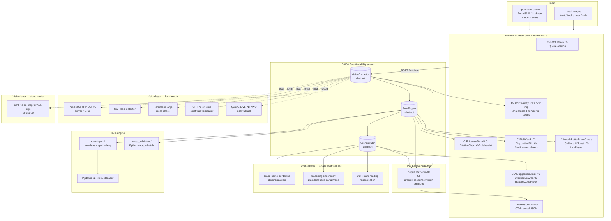

# Session 3 — App Stack & Architecture

**Project:** AI-powered TTB alcohol label verification — take-home prototype
**Status:** Decisions ready for implementation
**Date:** 2026-04-30
**Hardware target:** Windows 11 + WSL2 + NVIDIA RTX 3090 (24 GB VRAM)
**Prior context:** S1 vision stack (PaddleOCR PP-OCRv5 + SWT + Florence-2 + GPT-4o tiebreaker, Qwen2.5-VL-7B-AWQ fallback), S2 MVP scope, and anchor decisions D-002/D-004/D-005/D-007/D-010/D-011/D-012 are FIXED and not re-litigated below.

---

## 1. TL;DR — Decision Register

1. **Q1 Language split** → **Python backend (FastAPI + Jinja2 server-rendered shell) + a small React/TypeScript "evidence panel" island mounted into the page.** Hybrid keeps the GPU-bound PaddleOCR process in-process while letting the bbox+evidence UI use real React component primitives.
2. **Q2 Frontend component library** → **shadcn/ui (Radix + Tailwind), styled to USWDS color tokens.** Not Mantine (heavier, opinionated styling), not USWDS-React/`@trussworks/react-uswds` (federal-aligned but not needed for a prototype and ties us to USWDS 3.x markup).
3. **Q3 Pydantic v2** → **Yes, confirmed.** Used for the rule schema, the orchestrator's structured-output models, and the `RejectionReason` envelope.
4. **Q4 Bbox overlay rendering** → **SVG `<svg>` overlay over ``, with one `<g role="button" tabindex="0" aria-pressed="…">` per box.** Not Canvas, not `react-image-annotate`, not Konva.
5. **Q5 Session-only state** → **In-memory backend FastAPI process state, keyed by an opaque `batch_id` cookie; client holds only that ID.** Refresh re-fetches the same batch; full hard reload of the server tab loses progress (acceptable per T6 "re-upload on crash").
6. **Q6 Multi-image upload model** → **Single `Application` object containing `labels: []` array** (front/back/neck/side), per T2 §Q2.10 and T4 §4.7.
7. **Q7 Where the demo runs** → **Hugging Face Spaces (Docker SDK, T4-small or A10G dedicated GPU on demo day) as the deployed URL; localhost-via-WSL2 as the development path.** Not Vercel/Railway (no GPU); not fly.io (GPU offering deprecated, unavailable after 1 Aug 2024 per Fly docs); not Replit.
8. **Q8 Docker vs uv** → **Both, layered: `uv sync && uv run uvicorn …` is the primary path; `docker compose up` is a single-command alternative for reviewers who prefer it.** uv wins the <5-min reviewer ceiling on macOS/Linux/WSL2.
9. **Q9 Reviewer setup ceiling** → **One command (`uv run task demo` *or* `docker compose up`) works for all three reviewer profiles (Win11+WSL2+GPU, macOS no-GPU, Linux no-GPU)** by way of the dual-mode flag in Q12.
10. **Q10 Local model serving** → **Hugging Face Transformers + `accelerate` directly, called in-process from Python.** vLLM is rejected as the default because PaddleOCR's vLLM/SGLang backends "do not run natively on Windows; use the provided Docker images" (PaddleOCR DeepWiki) and a take-home shouldn't require Docker for the GPU path; Ollama lacks Florence-2 support; llama.cpp lacks Florence-2 support.
11. **Q11 Docker GPU passthrough** → **Compose `deploy.resources.reservations.devices: [{driver: nvidia, count: all, capabilities: [gpu]}]`** with NVIDIA Container Toolkit installed in WSL2 + Docker Desktop's WSL2 backend, NVIDIA driver ≥ 550 on the Windows host. Snippet provided in §Details.
12. **Q12 Single vs dual deployment mode** → **Dual-mode: `--vision=local` (default on machines with a GPU) and `--vision=cloud` (GPT-4o-on-crop for every leg, no PaddleOCR/Florence-2/Qwen needed).** Reviewers without a GPU run cloud mode; D-004 substitutability mandate is the same seam, so this is free.
13. **Q13 Logging** → **Structured JSON to stdout using OpenTelemetry GenAI semantic-convention attribute names (`gen_ai.request.model`, `gen_ai.response.model`, `gen_ai.usage.input_tokens`, etc.)**, no OTLP exporter. A future `OTEL_EXPORTER_OTLP_ENDPOINT` env var flips it to real OTel without code changes.
14. **Q14 LLM call logging** → **Yes, full prompt + response + vision envelope captured. In-memory bounded `collections.deque(maxlen=200)` per batch, indexed by `(batch_id, label_id, stage)`.** Surfaced as `C-RawJSONDrawer`.
15. **Q15 Rule data location** → **Hybrid (T3): canonical YAML in `rules/` (one file per beverage class plus `rules/spirits-deep.yaml`) + small Pydantic-validator "escape hatch" registry in `rules/_validators/` referenced by name.** Not "Pydantic-only with a stub YAML" — the YAML is real; validators are only for irregular checks.

---

## 2. Fifteen Numbered Answers

### Stack

**Q1 — Language split.**
**Decision:** FastAPI (Python) backend serving Jinja2 page shells with a thin React/TypeScript island for the bbox+evidence area, bundled by Vite into a single static asset. Reject Streamlit/Gradio because they "reload state poorly across multi-step demos" and have weak custom-component stories per the user's brief and per Squadbase's 2025 framework comparison; reject Next.js because it requires running two processes (Node + Python) and adds a dependency on `node` to the reviewer setup, defeating the <5-min ceiling.
*Grounding:* FastAPI is a standard ASGI framework with first-class Pydantic v2 integration for request/response schemas and is the recommended path for "server-side PaddleOCR-GPU process" deployments because the OCR pipeline call is just `pipeline.predict(image)` in-process. FastHTML+HTMX is a credible Python-native option (Ploomber, johal.in 2025 benchmark) but its component story is still HTML primitives, which is not enough to render `C-BboxOverlay` legibly with full keyboard semantics. The hybrid Jinja-shell-plus-React-island pattern is the smallest architecture that satisfies T8's component inventory legibility requirement without requiring a Node build pipeline for the entire app.

**Q2 — Frontend component library.**
**Decision:** **shadcn/ui** (copy-paste Radix-UI primitives styled with Tailwind), with a small token layer mapping shadcn's CSS variables to the USWDS color palette (`--primary` → `#005ea2`, etc.). Reject Mantine because its 100+ component kitchen-sink adds bundle weight and tightly couples the app to its design language, which is overkill for ~17 components in T8's inventory; reject `@trussworks/react-uswds` because, while actively maintained (v11.0.1, April 2025; v9.1.0, August 2024 per the GitHub release log), it is opinionated toward USWDS 3.x markup, depends on the legacy USWDS JS init pattern that "doesn't work when elements are added after initial page load" (uswds Discussion #4677), and the prototype is a take-home, not a federal deployment — federal alignment can be demonstrated by adopting USWDS *tokens* without inheriting USWDS *components*.
*Grounding:* USWDS has officially declined to ship first-party React components (uswds/uswds Discussion #4677), so the only React port is `@trussworks/react-uswds`, maintained by Truss with quarterly-ish releases pinned to specific USWDS versions. shadcn/ui's Radix base provides the same WAI-ARIA APG primitives (focus management, `aria-pressed`, dialogs) the bbox overlay needs. Tailwind-only is rejected because we'd reimplement Radix's accessibility plumbing; USWDS-React is rejected for take-home scope.

**Q3 — Pydantic v2.**
**Decision:** **Yes — Pydantic v2.x** as the single schema layer for (a) the YAML rule loader, (b) `RejectionReason` and `Verdict`, (c) OpenAI Structured Outputs `strict:true` request bodies via `client.chat.completions.parse(response_format=Model)`, and (d) Anthropic `tool_use` strict-mode tool schemas. Reject "no Pydantic" because the project would lose JSON Schema generation for the orchestrator's strict-mode tool calls. Reject Pydantic v1 because OpenAI's Python SDK `parse()` helper, JSON Schema sanitization for `strict:true`, and recent Pydantic AI features assume v2.
*Grounding:* The OpenAI Python SDK exposes `client.chat.completions.parse(... response_format=PydanticModel)` which validates the response in v2 and returns a typed `ParsedChatCompletion[T]` (OpenAI structured-outputs guide; openai-python source). Pydantic v2 dataclasses and `BaseModel` are both supported as response formats (DeepWiki openai-python).

**Q4 — Bbox overlay rendering.**
**Decision:** **SVG `<svg>` overlay positioned absolutely over an ``, one `<g>` per box with `role="button"`, `tabindex="0"`, `aria-pressed`, and `aria-labelledby` pointing at the matched `C-FieldCard`.** Reject Canvas because Canvas content is "not part of the DOM except for fallback content" (Paul Adam, W3C Wiki) and would require a parallel ARIA tree; reject `react-image-annotate` because it's an editor (drag/resize) and we ship read-only bboxes per the brief; reject Konva because Konva itself acknowledges "doesn't support keyboard accessibility when used with an html image map" (konvajs/konva Issue #367).
*Grounding:* SVG is the better choice for accessible interactive content because "SVG has internal accessibility semantics and ability to easily add interactivity with JavaScript," whereas Canvas should not be used to generate interactive UI controls (Paul Adam HTML5 Canvas Accessibility demo; jointjs.com SVG vs Canvas blog). For the read-only, ≤30-bbox-per-page case the prototype targets, SVG performs fine and gets keyboard focus rings, screen-reader announcements, and zoom-in scaling for free.

### State

**Q5 — Session-only state.**
**Decision:** **In-memory FastAPI process state**, organized as `app.state.batches: dict[str, BatchState]` keyed by `batch_id` (a UUID4 stored in an `HttpOnly; SameSite=Lax` cookie). The client holds *only* the batch ID; all RejectionReason JSON, vision envelopes, and orchestrator transcripts live server-side. Reject browser localStorage because (a) the orchestrator already runs server-side so the data has to be there anyway, (b) RejectionReason payloads can be 50+ KB per label and would bloat the client, and (c) localStorage is per-origin and persists past the session — fighting D-005 and D-007.
*Grounding:* T6 specifies "in-memory per-batch state, re-upload on crash recovery." Refresh semantics: a soft browser refresh hits `GET /batches/{batch_id}` and rehydrates the UI from server state; a server restart loses everything and the user re-uploads. This matches T6's recovery contract exactly.

**Q6 — Multi-image upload state model.**
**Decision:** **Single `Application` object with `labels: list[Label]`**, where each `Label` carries `surface ∈ {front, back, neck, side}`, `image_id`, and per-image extraction results. Reject "one application = one upload event" because T2 §Q2.10 explicitly commits to the Form-5100.31-shaped JSON envelope with a `labels` array, and T4 §4.7 mandates per-image processing with cross-image deduplication of the seven common fields.
*Grounding:* The cross-image dedup is an orchestrator responsibility — when "Brand Name: PIONEER" appears on both the front and the neck label, the orchestrator's reconciliation task collapses them into a single `extracted_field` with `evidence: [front-bbox-3, neck-bbox-1]`. That requires a single application root.

### Deployment

**Q7 — Where the demo runs.**
**Decision:** **Hugging Face Spaces with Docker SDK, A10G-small GPU tier on demo day, `cpu-basic` between sessions.** The repo ships a `Dockerfile` that boots the FastAPI app; HF Spaces handles TLS, public URL, and GPU attachment. Reject Vercel/Railway (no GPU); reject fly.io because GPU machines were deprecated per the official Fly Docs Pricing page ("GPUs are deprecated and will be unavailable after August 1") and as of April 2026 are no longer a viable option for new deployments; reject Replit (limited GPU). Reject "localhost only" because the brief mandates a deployed URL.
*Grounding:* The S2 demo's "pre-warmed orchestrator + LLM responses cached for 6 fixtures" means the *deployed* URL almost never needs the GPU — cached LLM responses cover the demo flow, and a small CPU PaddleOCR fallback handles ad-hoc reviewer uploads. So `cpu-basic` (free) is sufficient for 95% of the time, and the demo flow can be pre-warmed before the recorded walkthrough. HF Spaces' ZeroGPU shared infrastructure is **not** chosen as the default because ZeroGPU is "exclusively compatible with the Gradio SDK" (HF Spaces ZeroGPU docs), and the architecture uses FastAPI + Docker SDK; if needed, dedicated GPU upgrade to A10G-small ($1.00/hr per HF pricing, billed per-minute when running) is one-click. PaddleOCR-GPU on HF Spaces requires the Docker SDK because of the ~5 GB CUDA image size.

**Q8 — Docker vs uv.**
**Decision:** **uv is the primary path; Docker Compose is a layered alternative.** README lists both. uv is the de-facto modern Python package manager (Astral, 16M downloads/month in 2025 per Astral's Jane Street tech talk) and resolves+installs ~10–100× faster than pip; for a no-GPU reviewer on macOS/Linux running cloud mode, `uv sync && uv run uvicorn app.main:app` brings the demo up in under 30 seconds. Reject conda (rejected by the brief). Reject pip-only because pip-tools resolution on a fresh box can take minutes for a torch+transformers+paddleocr stack.
*Grounding:* The Astral docs confirm `uv sync` reads `pyproject.toml` and a universal `uv.lock`, creating `.venv` and installing reproducibly from a single static binary that has "no direct Python dependency" (Astral uv blog, datacamp 2026 guide). For the GPU path, the Compose file mounts the same source tree and invokes the same entrypoints — no behavioral divergence.

**Q9 — Reviewer setup ceiling.**
**Decision:** **One command on all three reviewer profiles.** Documented as:
- **(a) Win11 + WSL2 + GPU:** `uv sync --extra gpu && uv run task demo` (vision=local, full PaddleOCR + Florence-2 path).
- **(b) macOS no-GPU:** `uv sync && uv run task demo` (vision=cloud automatic; needs `OPENAI_API_KEY`).
- **(c) Linux no-GPU:** identical to (b).
- **Docker alternative for any of the three:** `docker compose up demo` (CPU image) or `docker compose --profile gpu up demo-gpu` (GPU image).
Reject any answer that requires reviewers to run two terminals or install Node — those break the <5-min `git clone`-to-running ceiling.
*Grounding:* uv's `--extra gpu` switches `paddlepaddle-gpu` in via the Paddle CU126 index URL `https://www.paddlepaddle.org.cn/packages/stable/cu126/` (PaddleX install docs); the no-GPU extra installs `paddlepaddle` CPU wheel from PyPI.

### Local model serving

**Q10 — vLLM vs llama.cpp vs Ollama vs Transformers.**
**Decision:** **Hugging Face `transformers` + `accelerate`, called in-process** (no separate server) for both Florence-2-large and Qwen2.5-VL-7B-Instruct-AWQ. Reject vLLM as the *default* because (i) PaddleOCR's vLLM/SGLang backends "do not run natively on Windows; use the provided Docker images" (PaddleOCR DeepWiki §2.2.2), and (ii) vLLM is overkill for a take-home where we serve one user at a time. Reject Ollama because Ollama does not support Florence-2 — there is an open feature request on the model card with no resolution ("Please add to llama.cpp and ollama," HF discussion #21, microsoft/Florence-2-large) — and we'd be running two model frameworks. Reject llama.cpp for the same reason: "Feature Request: Support for Florence-2 Vision Models" (ggml-org/llama.cpp Issue #8012) remains open as of 2026.
*Grounding:* Florence-2 is shipped only as a `transformers`+`trust_remote_code=True` model with `AutoModelForCausalLM.from_pretrained("microsoft/Florence-2-large", torch_dtype=torch.float16, trust_remote_code=True).to("cuda:0")` per Microsoft's HF model card. Qwen2.5-VL-7B-Instruct-AWQ is *also* available via `transformers` (HF model card) — the AWQ savings are smaller in practice ("running in vLLM it ends up taking the same space in vRAM eventually," QwenLM/Qwen2.5-VL Issue #532) so the prototype gets minimal benefit from a vLLM server. Keeping all three local models in one process means one venv, one CUDA context (~14–18 GB on a 24 GB 3090 with PaddleOCR + Florence-2 + AWQ-Qwen co-resident), and no inter-process JSON marshaling. The orchestrator's tiebreaker LLM is GPT-4o (cloud), so we don't need vLLM's XGrammar/Outlines constrained-decoding for the prototype's MVP.

**Q11 — Docker GPU passthrough on Windows + WSL2.**
**Decision:** Compose snippet (target: `docker-compose.gpu.yml`):
```yaml
services:
  demo-gpu:
    build:
      context: .
      dockerfile: Dockerfile.gpu
    image: ttb-label/demo-gpu:0.1.0
    ports: ["8000:8000"]
    deploy:
      resources:
        reservations:
          devices:
            - driver: nvidia
              count: all
              capabilities: [gpu]
    environment:
      VISION_MODE: local
      NVIDIA_VISIBLE_DEVICES: all
    shm_size: "8gb"
```
Prerequisites on the Windows 11 host: (a) NVIDIA driver ≥ 550.54.14 for CUDA 12.6 (per PaddleX install docs requirement matrix); (b) WSL2 enabled with `wsl --update` to latest kernel; (c) Docker Desktop with the WSL2 backend (Docker Desktop ↦ Settings ↦ General ↦ "Use the WSL 2 based engine" + Resources ↦ WSL Integration enabled for the chosen distro); (d) NVIDIA Container Toolkit installed inside WSL2 (`sudo apt-get install -y nvidia-container-toolkit; sudo nvidia-ctk runtime configure --runtime=docker`).
*Grounding:* Docker's official "GPU support in Docker Desktop for Windows" docs state plainly: "GPU support in Docker Desktop is only available on Windows with the WSL2 backend… Docker Desktop for Windows supports NVIDIA GPU Paravirtualization (GPU-PV) on NVIDIA GPUs." Microsoft's "Enable NVIDIA CUDA on WSL 2" Learn doc and NVIDIA's CUDA-on-WSL user guide confirm the install of an NVIDIA CUDA-enabled driver for WSL is the only host-side step required. The Compose `deploy.resources.reservations.devices` form with `driver: nvidia, count: all, capabilities: [gpu]` is the canonical syntax (Docker Compose Deploy Specification + Docker docs "Run Docker Compose services with GPU access"). Verification: `docker run --rm --gpus=all nvcr.io/nvidia/k8s/cuda-sample:nbody nbody -gpu -benchmark`.

**Q12 — Single vs dual deployment mode.**
**Decision:** **Dual-mode is the recommended ceiling** — the same code paths via the `VisionExtractor` interface (D-004), with two concrete implementations: `LocalVisionExtractor` (PaddleOCR + SWT + Florence-2 + GPT-4o tiebreak) and `CloudVisionExtractor` (GPT-4o-on-crop for OCR, Structured Outputs for fields, with Brand Name disambiguation + bold-detection both routed to GPT-4o vision calls). A `--vision={local,cloud,auto}` CLI flag (and `VISION_MODE` env var) selects at startup; `auto` probes for `nvidia-smi` and falls back to cloud if not present. Reject single-mode (assumes GPU) because the brief says "reviewer is technical but not assumed to have local GPU"; reject single-mode (cloud-only) because it would discard the project's OCR-determinism story.
*Grounding:* D-004's substitutability mandate already requires the `VisionExtractor` abstract base. Dual mode is therefore "free architecture" — it's the first concrete demonstration of D-004, not an addition. Modest API cost: the 6 demo fixtures × ~7 fields × ~2 GPT-4o-vision calls ≈ 84 calls × ~$0.005 each ≈ $0.42 per full demo run.

### Logging & observability

**Q13 — Structured JSON to stdout vs full OTel.**
**Decision:** **Structured JSON to stdout, attribute names borrowed from OpenTelemetry GenAI semantic conventions.** Each LLM call emits a single JSON line with the keys `gen_ai.operation.name`, `gen_ai.provider.name`, `gen_ai.request.model`, `gen_ai.response.model`, `gen_ai.usage.input_tokens`, `gen_ai.usage.output_tokens`, `server.address`, `gen_ai.input.messages` (truncated hash), `gen_ai.output.messages` (full), plus project-specific extras `prompt_version`, `rule_set_version`, `input_hash`, `output_hash`, `latency_ms`, `ttft_ms`, `batch_id`, `label_id`. Reject full OTLP-export-with-collector for a take-home — running an `otel-collector` sidecar adds another container, defeats the <5-min ceiling, and isn't observed by the reviewer. Reject ad-hoc loguru-only because that loses the upgrade path.
*Grounding:* OTel's GenAI semantic-conventions registry (opentelemetry.io/docs/specs/semconv/registry/attributes/gen-ai/) lists the canonical attribute names; the in-development OTel Python `instrumentation-genai` library wraps the OpenAI client to emit exactly these names (OpenTelemetry blog, "OpenTelemetry for Generative AI"). The latest GenAI semconv (v1.38+) deprecates the old `gen_ai.prompt`/`gen_ai.completion` pair in favor of `gen_ai.input.messages`/`gen_ai.output.messages` (traceloop/openllmetry Issue #3515) — we follow the new names. To upgrade: set `OTEL_EXPORTER_OTLP_ENDPOINT`, swap the JSON-line formatter for `OTLPSpanExporter`, no application-code changes.

**Q14 — LLM call logging for the demo Raw panel.**
**Decision:** **Yes, full prompt + response capture; in-memory ring buffer per batch.** Data structure:
```python
from collections import deque
from typing import Literal

@dataclass
class CallRecord:
    ts: datetime
    batch_id: str
    label_id: str
    stage: Literal["vision.paddleocr", "vision.swt", "vision.florence2",
                   "vision.gpt4o_tiebreak", "vision.qwen_fallback",
                   "rule.evaluate", "orch.brand_disambig",
                   "orch.reasoning_enrich", "orch.ocr_reconcile"]
    request: dict   # full prompt / image-hash / params
    response: dict  # full structured output
    latency_ms: int
    model: str | None
    provider: str | None  # "openai", "anthropic", "local.transformers"
    prompt_version: str | None
    output_hash: str

# in BatchState:
calls: deque[CallRecord] = field(default_factory=lambda: deque(maxlen=200))
```
The `C-RawJSONDrawer` component fetches `GET /batches/{batch_id}/labels/{label_id}/calls` and renders the records grouped by stage. Reject "log to file only" — reviewer can't see it. Reject "full unbounded list" — a stuck batch could OOM the process; a 200-record cap × ~12 KB/record ≈ 2.4 MB, safe.
*Grounding:* T8's `C-RawJSONDrawer` requirement explicitly demands "the full structured RejectionReason JSON, the full orchestrator prompt + output (when an LLM was involved), the full vision response envelope," and T5 §Recommendation #8 demands `prompt_version`, `model_version`, `rule_set_version`, `input_hash`, `output_hash`, `latency_ms`, `ttft_ms`. The deque keeps insertion O(1) and capped, matching T6's "in-memory per-batch state."

### Rule data

**Q15 — Rule data location.**
**Decision:** **Real YAML files under `rules/`** — `rules/common-fields.yaml`, `rules/wine.yaml`, `rules/malt.yaml`, `rules/distilled.yaml`, plus `rules/spirits-deep.yaml` for the spirits-deep rule pack — loaded by a Pydantic v2 `RuleSet` model. Irregular checks (e.g., the §16.21 health-warning bold-and-caps composite check, brand-name fuzzy match thresholds) reference Python validators by *name* from YAML, e.g. `validator: spirits.health_warning_bold_caps`, resolved against a `rules/_validators/` registry. Reject "Pydantic-only with a stub YAML" because the brief's option (a) explicitly requests "actual YAML files for the spirits-deep rule pack to demonstrate D-005 legibly" — the legibility argument wins for a take-home where the reviewer needs to *see* the per-field policy structure. Reject "hard-coded only" because gaps-and-limitations §1 frames externalization as the production-form, and shipping it as YAML now turns that gap into a delivered feature.
*Grounding:* T3's hybrid-YAML decision was reconciled with 05-gaps-and-limitations §1 by saying the prototype "may ship with a small hard-coded validator set whose shape MIRRORS the YAML schema." We go one step further — the rule data itself ships as YAML, and only the *escape-hatch validators* are Python. This makes D-005 ("per-field match policies") concretely visible: a reviewer can `cat rules/distilled.yaml` and see `match_policy: jaro_winkler_0.85_0.95` on the brand-name field.

---

## 3. Architecture Diagram



The three abstract interfaces (`VisionExtractor`, `Orchestrator`, `RuleEngine`) are the three swap points for D-004. In `--vision=cloud`, only the lower-left subgraph swaps for `CloudVision`; everything else is identical.

---

## 4. Folder Layout

```
ttb-label-prototype/
├─ pyproject.toml                       # uv-managed; [project.optional-dependencies] gpu = ["paddlepaddle-gpu==3.0.0", ...]
├─ uv.lock
├─ Dockerfile                           # CPU image (cloud vision mode)
├─ Dockerfile.gpu                       # CUDA 12.6 base + paddlepaddle-gpu + transformers
├─ docker-compose.yml                   # demo: CPU image
├─ docker-compose.gpu.yml               # demo-gpu: GPU image with deploy.resources.reservations.devices
├─ README.md                            # one-command setup for all 3 reviewer profiles
├─ .env.example                         # OPENAI_API_KEY, ANTHROPIC_API_KEY, VISION_MODE
│
├─ app/
│  ├─ main.py                           # FastAPI app factory; mounts UI + API routes
│  ├─ deps.py                           # DI container; chooses VisionExtractor by VISION_MODE
│  ├─ config.py                         # Pydantic Settings (env-driven)
│  │
│  ├─ api/
│  │  ├─ batches.py                     # POST /batches, GET /batches/{id}, etc.
│  │  ├─ labels.py                      # per-label endpoints
│  │  └─ raw.py                         # GET /batches/{id}/labels/{lid}/calls — feeds C-RawJSONDrawer
│  │
│  ├─ vision/                           # === D-004 SWAP SEAM #1 ===
│  │  ├─ base.py                        # class VisionExtractor (Protocol/ABC)
│  │  ├─ local.py                       # LocalVisionExtractor — PaddleOCR + SWT + Florence-2 + GPT-4o + Qwen
│  │  ├─ cloud.py                       # CloudVisionExtractor — GPT-4o-on-crop for everything
│  │  ├─ paddle_runner.py               # in-process PP-OCRv5 wrapper
│  │  ├─ swt.py                         # stroke-width-transform bold detector
│  │  ├─ florence2.py                   # transformers-based Florence-2 wrapper
│  │  ├─ qwen_vl.py                     # transformers-based Qwen2.5-VL-AWQ fallback
│  │  └─ tiebreak_gpt4o.py              # strict:true Structured Outputs tiebreak
│  │
│  ├─ rules/                            # === D-004 SWAP SEAM #2 ===
│  │  ├─ engine.py                      # class RuleEngine (ABC); evaluate() returns Verdict + RejectionReason
│  │  ├─ yaml_engine.py                 # concrete YAML+Pydantic implementation
│  │  ├─ models.py                      # Pydantic v2 RuleSet, Rule, MatchPolicy, Verdict
│  │  └─ brand_match.py                 # D-012 Stage A normalized exact + Stage B Jaro-Winkler 0.85/0.95
│  │
│  ├─ orchestrator/                     # === D-004 SWAP SEAM #3 ===
│  │  ├─ base.py                        # class Orchestrator (ABC)
│  │  ├─ openai_strict.py               # OpenAI strict:true, temp=0, snapshot-pinned model
│  │  ├─ anthropic_strict.py            # Anthropic tool_use strict:true (swap-in)
│  │  ├─ vllm_xgrammar.py               # vLLM + XGrammar (swap-in path; not used by default)
│  │  └─ tasks/
│  │     ├─ brand_disambig.py           # MVP task #1
│  │     ├─ reasoning_enrich.py         # MVP task #2
│  │     └─ ocr_reconcile.py            # MVP task #3
│  │
│  ├─ logging/
│  │  ├─ otel_genai.py                  # JSON formatter using gen_ai.* attribute names
│  │  └─ ring_buffer.py                 # CallRecord deque(maxlen=200), per BatchState
│  │
│  ├─ batch/
│  │  ├─ state.py                       # BatchState dataclass; in-memory dict[str, BatchState]
│  │  ├─ worker.py                      # asyncio single-process worker; k=2-3 lookahead
│  │  └─ queue.py                       # in-process FIFO (asyncio.Queue)
│  │
│  ├─ ui/
│  │  ├─ templates/                     # Jinja2 page shells
│  │  │  ├─ base.html
│  │  │  ├─ batch.html                  # mounts the React island
│  │  │  └─ partials/                   # HTMX-style partials for table updates
│  │  └─ static/
│  │     └─ island/                     # built React bundle (Vite output)
│  │
│  └─ schemas/
│     ├─ application.py                 # Form-5100.31 envelope; Pydantic v2
│     ├─ extracted.py                   # ExtractedField, EvidenceBox, Confidence
│     └─ rejection.py                   # RejectionReason w/ rule citation (D-007)
│
├─ frontend/                            # React island only (small)
│  ├─ package.json                      # shadcn/ui, Radix, Tailwind, vite
│  ├─ src/
│  │  ├─ components/                    # T8 component inventory
│  │  │  ├─ DispositionPill.tsx
│  │  │  ├─ BboxOverlay.tsx             # SVG over , aria-pressed
│  │  │  ├─ EvidencePanel.tsx
│  │  │  ├─ FieldCard.tsx
│  │  │  ├─ RuleVerdict.tsx
│  │  │  ├─ AISuggestionBlock.tsx
│  │  │  ├─ ConfidenceIndicator.tsx
│  │  │  ├─ CitationChip.tsx
│  │  │  ├─ OverrideDrawer.tsx
│  │  │  ├─ ReasonCodePicker.tsx
│  │  │  ├─ NeedsBetterPhotoCard.tsx
│  │  │  ├─ RawJSONDrawer.tsx
│  │  │  ├─ BatchTable.tsx
│  │  │  ├─ QueuePosition.tsx
│  │  │  ├─ Alert.tsx / Toast.tsx
│  │  │  └─ LiveRegion.tsx
│  │  └─ tokens/
│  │     └─ uswds-tokens.css            # USWDS color tokens mapped to shadcn CSS vars
│  └─ vite.config.ts
│
├─ rules/                               # === T3 RULE DATA — canonical YAML ===
│  ├─ common-fields.yaml                # 7 fields applied to all 3 classes
│  ├─ wine.yaml
│  ├─ malt.yaml
│  ├─ distilled.yaml
│  ├─ spirits-deep.yaml                 # the spirits-deep rule pack
│  └─ _validators/                      # Python "escape-hatch" registry
│     ├─ __init__.py                    # name → callable registry
│     ├─ health_warning.py              # §16.21 caps + bold composite check
│     └─ brand_match.py                 # named validator wrapping app.rules.brand_match
│
├─ fixtures/                            # 6 demo fixtures
│  ├─ 01-wine-cabernet/
│  │  ├─ application.json
│  │  ├─ front.jpg
│  │  ├─ back.jpg
│  │  └─ cached_responses.json          # pre-warmed LLM responses (deterministic demo)
│  ├─ 02-wine-prosecco/
│  ├─ 03-malt-ipa/
│  ├─ 04-malt-stout-no-warning/
│  ├─ 05-distilled-bourbon/
│  └─ 06-distilled-vodka-blurry/        # exercises C-NeedsBetterPhotoCard
│
├─ configs/
│  ├─ vision.local.toml                 # GPU-path defaults
│  ├─ vision.cloud.toml                 # GPT-4o-only defaults
│  └─ orchestrator.toml                 # snapshot-pinned model IDs, temp=0, fixed seed
│
├─ docs/
│  ├─ 01-context.md
│  ├─ 02-architecture.md                # ← rewritten in §6 below
│  ├─ 03-decisions.md                   # ← four new ADRs in §5 below
│  ├─ 04-rule-data.md
│  └─ 05-gaps-and-limitations.md
│
└─ tests/
   ├─ test_vision_substitutability.py   # asserts both implementations satisfy VisionExtractor
   ├─ test_rules_yaml_round_trip.py
   ├─ test_brand_match_policies.py      # D-012 thresholds
   └─ test_orchestrator_strict.py       # mocks OpenAI strict:true responses
```

The three swap seams (`app/vision/base.py`, `app/rules/engine.py`, `app/orchestrator/base.py`) live next to their concrete implementations so a reader can `ls app/vision/` and immediately see `base.py`, `local.py`, `cloud.py` — D-004 substitutability is *legible at the directory level*.

---

## 5. Four New ADRs — `03-decisions.md` Format

### D-013 — Application stack choice (language split + frontend lib + bbox renderer)

- **Status:** Accepted
- **Date:** 2026-04-30
- **Context.** The prototype must (a) run on a reviewer's machine in <5 min from `git clone`, (b) demonstrate D-004 substitutability legibly, (c) surface T8's 17-component inventory legibly including `C-BboxOverlay` with keyboard navigation, (d) support batch upload + adaptive lookahead UI, (e) work for reviewers without local GPU. The S1 vision stack mandates a server-side Python process (PaddleOCR-GPU is in-process Python; Florence-2 and Qwen2.5-VL load via Hugging Face `transformers`), which forces Python on the backend. The question is what runs on the *frontend* and how the two halves connect.
- **Decision.** **FastAPI (Python) backend rendering Jinja2 page shells + a small React/TypeScript island (built with Vite) for the bbox + evidence area. Frontend components are shadcn/ui (Radix UI + Tailwind), themed with USWDS color tokens. `C-BboxOverlay` is implemented as an SVG `<svg>` overlay positioned absolutely over an ``, with one `<g role="button" tabindex="0" aria-pressed>` per box.**
- **Rationale.**
    1. Python-on-backend is forced by S1; FastAPI is the modern ASGI choice with first-class Pydantic v2 integration for the structured-output contracts the orchestrator requires.
    2. Streamlit and Gradio "reload state poorly across multi-step demos and have weak custom-component stories" (project brief; corroborated by 2025 Streamlit-vs-Gradio comparisons). The take-home demo has multi-step interactions (override drawer, citation chips, raw-JSON inspection) that need real state retention.
    3. Next.js requires running two processes (Node + Python), defeating the <5-min ceiling.
    4. FastHTML+HTMX is Python-native and credible (Ploomber benchmark, johal.in 2025) but its component story is HTML primitives only, insufficient for the 17-component T8 inventory.
    5. shadcn/ui's Radix base provides WAI-ARIA APG focus management, `aria-pressed`, dialog primitives, and live regions — exactly what `C-BboxOverlay`, `C-OverrideDrawer`, `C-LiveRegion` need. Mantine is rejected as kitchen-sink heavy and visually opinionated. `@trussworks/react-uswds` is rejected: while actively maintained (v11.0.1, 2025), it is opinionated toward USWDS 3.x markup, depends on the legacy USWDS JS init pattern that "doesn't work when elements are added after initial page load" (uswds Discussion #4677), and federal alignment can be demonstrated by adopting USWDS *tokens* without inheriting USWDS *components*.
    6. SVG over `` is the canonical accessible answer (SVG is in the DOM, supports ARIA natively, scales without pixelation; Canvas content "is not part of the DOM except for fallback content," Paul Adam HTML5 Canvas Accessibility demo). `react-image-annotate` is an editor we don't need; Konva acknowledges its own keyboard-accessibility gap (konvajs/konva Issue #367).
- **Alternatives considered.**
    - **Streamlit.** Rejected: state lost on reruns; custom components require React anyway.
    - **Gradio.** Rejected: ML-demo-shaped; no clean batch-upload UI; requires HF-flavored deployment patterns.
    - **FastHTML + HTMX.** Rejected: pure-Python is appealing but rendering 17 distinct interactive components without copy-paste primitives means writing ARIA plumbing by hand.
    - **Next.js (TS-only).** Rejected: two processes; Python child-process for vision is fragile.
    - **Mantine.** Rejected: heavy bundle, opinionated styling.
    - **Plain Tailwind without component lib.** Rejected: would re-implement Radix.
    - **Canvas / `react-image-annotate` / Konva for bboxes.** Rejected for accessibility (above).
- **Consequences.**
    - Repo has a tiny frontend build (`frontend/`, ~2 MB node_modules during dev; pre-built island shipped as a static asset in `app/ui/static/island/` for runtime).
    - Reviewer who runs `uv sync && uv run task demo` does *not* need Node — the built island is committed. (Frontend developers `cd frontend && pnpm dev` only when changing the island.)
    - shadcn/ui is copy-paste, so we own the source — no upstream-bump risk.
    - SVG bboxes work with browser zoom and screen readers; we get keyboard navigation and `aria-pressed` for free.

---

### D-014 — Rule data format (YAML vs hard-coded Pydantic)

- **Status:** Accepted
- **Date:** 2026-04-30
- **Context.** T3 specified rules-as-data hybrid (YAML files canonical; small Python "escape hatch" validators referenced by name from YAML). 05-gaps-and-limitations §1 noted "rule set is hard-coded for the prototype; rule changes require code changes; a production version would externalize rules as data." T3's reconciliation said the prototype may ship with a small hard-coded validator set whose shape mirrors the YAML schema, so migration becomes mechanical. The specific question for the prototype: ship actual YAML for the spirits-deep rule pack, or ship Pydantic-with-the-shape-of-YAML and a stub `rules/spirits.yaml`?
- **Decision.** **Real YAML files under `rules/` (one per beverage class plus `rules/spirits-deep.yaml`), loaded by a Pydantic v2 `RuleSet` model. Irregular checks reference Python validators *by name* from a `rules/_validators/` registry.**
- **Rationale.**
    1. D-005 ("per-field match policies") is a story we tell with the rule data. Putting `match_policy: jaro_winkler_0.85_0.95` directly in `rules/distilled.yaml` makes the policy visible to a reviewer in one `cat` command.
    2. Hybrid is what T3 already chose; we are not deviating, only choosing the *concrete-form-as-shipped* (YAML) over the *transitional-form* (Pydantic-with-stub).
    3. The escape-hatch registry pattern (`validator: spirits.health_warning_bold_caps` resolving against a Python registry) handles every irregular check without forcing the YAML schema to grow grammar for arbitrary logic.
    4. Pydantic v2 gives us validation, JSON Schema generation, and clear errors for malformed YAML at startup.
- **Alternatives considered.**
    - **Pydantic-only with a stub YAML.** Rejected because the stub reads as a placeholder, not as the production form, hurting D-005 legibility.
    - **Pure YAML with embedded Python via PyYAML object construction.** Rejected as a security hazard.
    - **JSON Schema files instead of YAML.** Rejected: YAML is more human-readable; we still emit JSON Schema from Pydantic for tooling.
    - **External rules engine (Drools, OPA).** Rejected: out of scope for a take-home; the hybrid Pydantic+YAML+name-registry covers all needed cases at a fraction of the complexity.
- **Consequences.**
    - Reviewers can see the rule pack and understand per-field policies without reading code.
    - Adding a new rule for the spirits-deep pack is a YAML edit + (possibly) a new validator function + adding it to the registry — no schema change.
    - Migration to a production rule store (database, OPA bundle) is a serializer swap; the data shape is canonical.
    - Validator naming becomes a contract — renaming a Python function requires updating the YAML.

---

### D-015 — Deployment mode (single GPU vs dual GPU+cloud) and where the demo runs

- **Status:** Accepted
- **Date:** 2026-04-30
- **Context.** The take-home reviewer may not have a GPU. The S1 vision stack assumes GPU (PaddleOCR-GPU + Florence-2 + Qwen2.5-VL on a 24 GB device). A single-mode design forces every reviewer to have a 3090. A dual-mode design lets `--vision=cloud` route every image-input leg through GPT-4o, preserving the demo signal at modest cost. Separately, the deployed-URL deliverable needs to live somewhere with TLS and a stable URL, and not all platforms support GPU (Vercel/Railway: no GPU; fly.io: GPU machines deprecated as of 2024 per official Fly docs; HF Spaces: free CPU + paid dedicated GPU + ZeroGPU shared GPU restricted to Gradio SDK).
- **Decision.**
    1. **Dual deployment mode**: same `VisionExtractor` interface (D-004), two concrete implementations (`LocalVisionExtractor`, `CloudVisionExtractor`) selected by `VISION_MODE={local,cloud,auto}`. `auto` probes for a CUDA device and falls back to cloud.
    2. **Demo URL hosted on Hugging Face Spaces with the Docker SDK**, default hardware `cpu-basic` (free) for the deployed URL — sufficient because the 6 demo fixtures ship with cached LLM responses and the `--vision=cloud` mode is the deployed default. Optional one-click upgrade to A10G-small ($1/hr per HF pricing, billed per minute) for live GPU demos.
- **Rationale.**
    1. Dual-mode is *free architecture* — D-004 already mandates the `VisionExtractor` abstract base, so adding a second concrete implementation costs nothing structural and gives us substitutability legibility for free.
    2. HF Spaces Docker SDK supports our FastAPI + custom Dockerfile shape (HF Spaces docs); ZeroGPU is "exclusively compatible with the Gradio SDK" so we cannot use it. Running CPU-only at the public URL with cached fixture responses is fine — the demo flow is pre-warmed; the deployed URL is for the recorded walkthrough, not for production traffic.
    3. fly.io GPUs are deprecated (Fly docs Pricing page: "GPUs are deprecated and will be unavailable after August 1") and not viable for a 2026 deployment.
    4. Vercel/Railway/Replit have no GPU offerings of the form we need.
    5. Modest API cost: 6 demo fixtures × ~7 fields × ~2 GPT-4o-vision calls ≈ ~$0.42/demo run.
- **Alternatives considered.**
    - **Single GPU mode.** Rejected: forces reviewer to have NVIDIA hardware.
    - **Single cloud mode.** Rejected: discards the OCR-determinism story and the 24 GB local-model demonstration.
    - **fly.io GPU machines.** Rejected: officially deprecated.
    - **HF Spaces ZeroGPU.** Rejected: Gradio-only, conflicts with FastAPI architecture.
    - **AWS/GCP custom GPU instance.** Rejected: setup cost exceeds the take-home time budget.
    - **Localhost-only.** Rejected: deliverables explicitly require a deployed URL.
- **Consequences.**
    - Reviewers without a GPU can run the full demo with `OPENAI_API_KEY` and no other setup.
    - Reviewers with a 3090 see the local-vision path; the same UI surfaces both.
    - Public URL is stable and free at idle.
    - Cached fixtures must be re-generated whenever model snapshots change — handled by a `scripts/regenerate_fixtures.py` script.

---

### D-016 — Local model serving framework (vLLM vs llama.cpp vs Ollama vs Transformers)

- **Status:** Accepted
- **Date:** 2026-04-30
- **Context.** The S1 stack includes Florence-2-large (cross-check) and Qwen2.5-VL-7B-Instruct-AWQ (local VLM fallback) running locally on a 24 GB 3090. We need to decide *how* to serve these in the prototype.
- **Decision.** **Hugging Face `transformers` + `accelerate`, called in-process from the FastAPI worker.** No separate inference server. Models load once at startup, kept resident on `cuda:0`.
- **Rationale.**
    1. **Florence-2 is not supported** in either Ollama or llama.cpp. The official Florence-2 HF model card uses `AutoModelForCausalLM.from_pretrained("microsoft/Florence-2-large", trust_remote_code=True)` exclusively. The llama.cpp feature request (ggml-org/llama.cpp Issue #8012, "Feature Request: Support for Florence-2 Vision Models") and the Ollama community request (microsoft/Florence-2-large HF discussion #21) both remain open.
    2. **Qwen2.5-VL-7B is supported** in vLLM, Transformers, and Ollama (`ollama pull qwen2.5vl:7b`), but practical reports note "running in vLLM it ends up taking the same space in vRAM eventually (~22GB) as the bf16 version" (QwenLM/Qwen2.5-VL Issue #532), so AWQ savings are smaller in practice. For one-user prototype throughput, the transformers path is simpler.
    3. **vLLM is rejected as the default** because (a) PaddleOCR's vLLM/SGLang backends "do not run natively on Windows; use the provided Docker images" (PaddleOCR DeepWiki §2.2.2), and our take-home should not require a Docker-only path for the GPU demo, and (b) vLLM is overkill for one user.
    4. **Ollama and llama.cpp are rejected** because both lack Florence-2 support — going single-framework keeps complexity low.
    5. **In-process Transformers** uses one venv, one CUDA context, and no inter-process JSON marshaling. With FP16, the resident set is ~3 GB (Florence-2-large) + ~6 GB (Qwen2.5-VL-7B-AWQ in 4-bit) + ~1.5 GB (PaddleOCR PP-OCRv5 server) = ~10–11 GB, leaving headroom on the 24 GB 3090 for KV-cache, batch images, and Python overhead.
    6. The vLLM/XGrammar swap-in path (per T5) is preserved in `app/orchestrator/vllm_xgrammar.py` as a non-default implementation — D-004 substitutability is honored.
- **Alternatives considered.**
    - **vLLM as default.** Rejected: Windows + Paddle interaction; one-user throughput doesn't need it.
    - **Ollama.** Rejected: no Florence-2.
    - **llama.cpp + GBNF.** Rejected: no Florence-2; VLM support varies by build.
    - **Mixed (Ollama for Qwen, Transformers for Florence-2).** Rejected: two frameworks, two failure modes, two upgrade paths.
- **Consequences.**
    - Single framework keeps the dependency graph small.
    - Cold-start on the GPU path is ~30–45 s (model loads); we mitigate with a `/healthz` warmup endpoint hit at container start.
    - Lower inference throughput than vLLM under contention — acceptable for one-user demos and for the cached-fixture deployed URL.
    - Migrating to vLLM later is a `VisionExtractor`/`Orchestrator` swap, not a rewrite.

---

## 6. Updated `02-architecture.md`

> *Replaces the prior federal-deployment-shaped draft with the actual prototype shape. Existing four guiding principles preserved.*

```markdown
# Architecture (Prototype)

## Guiding principles (unchanged from prior version)

1. **Deterministic core, AI orchestrates not decides.** (D-002)
2. **Cloud/on-prem substitutability.** Every external dependency hides behind a project-owned interface. (D-004)
3. **Per-field match policies.** Rules express what counts as "matches" per field. (D-005)
4. **Rejection reasoning with rule citation.** Every fail/needs-review carries a structured reason and a citation back to a rule. (D-007)

## High-level data flow

```
[Application JSON + label images]
        │
        ▼
[FastAPI ingest endpoint] ── validates against Form-5100.31 envelope
        │
        ▼
[Batch worker (asyncio, k=2-3 lookahead)]
        │
        ├──► [VisionExtractor.extract(image)] ──► ExtractedFields + EvidenceBoxes
        │       (LocalVisionExtractor: PaddleOCR + SWT + Florence-2 cross-check;
        │        GPT-4o-on-crop tiebreaker for low-confidence; Qwen2.5-VL fallback)
        │       (CloudVisionExtractor: GPT-4o-on-crop for every leg)
        │
        ├──► [RuleEngine.evaluate(application, extracted)] ──► Verdicts + RejectionReasons
        │       (YAML-loaded rules + Python escape-hatch validators)
        │
        ├──► [Orchestrator.refine(verdicts, extracted, app)] ──► enriched output
        │       (3 single-shot strict tool-calls: brand-disambig, reasoning-enrich, OCR-reconcile)
        │
        ▼
[BatchState in-memory] ── ring buffer of LLM/vision call records
        │
        ▼
[Server-side Jinja2 + React island UI] ── renders T8 components
```

## Core components

- **VisionExtractor** *(abstract; D-004 swap point #1)*
  - `LocalVisionExtractor` — runs PaddleOCR PP-OCRv5 (GPU), SWT bold detector, Florence-2-large via `transformers`, GPT-4o-on-crop strict tiebreak, Qwen2.5-VL-7B-AWQ via `transformers` as fallback.
  - `CloudVisionExtractor` — every leg via GPT-4o-on-crop with `strict:true` Structured Outputs.
  - Both return identical `ExtractedFields` + `EvidenceBox` shapes.
- **RuleEngine** *(abstract; D-004 swap point #2)*
  - `YamlRuleEngine` — loads `rules/*.yaml` into Pydantic v2 `RuleSet`; evaluates each field against its declared `match_policy` (e.g., `normalized_exact`, `jaro_winkler_0.85_0.95` per D-012); irregular checks dispatch to named validators in `rules/_validators/`.
  - Returns a list of `Verdict` objects, each with a `RejectionReason` containing a rule citation (D-007).
- **Orchestrator** *(abstract; D-004 swap point #3)*
  - `OpenAIStrictOrchestrator` — single-shot `tool_choice` with `strict:true`, `temperature=0`, fixed seed, snapshot-pinned model. Three MVP tasks: brand-name borderline disambiguation, reasoning enrichment (paraphrase rule output to plain language), OCR multi-reading reconciliation.
  - `AnthropicStrictOrchestrator` — Anthropic `tool_use` strict mode (swap-in path).
  - `VllmXgrammarOrchestrator` — vLLM + XGrammar/Outlines (swap-in; not the prototype default per D-016).
- **BatchState + asyncio worker.** Single-process pull-based reactive-streams worker; open-loop k=2–3 lookahead; in-process FIFO; in-memory state per-batch; "re-upload on crash" recovery contract (T6).
- **UI.** FastAPI serves Jinja2 page shells; a small React island (shadcn/ui + Radix + Tailwind, USWDS color tokens) handles the bbox overlay and evidence panels, mounted into the page. Bbox overlay uses SVG over `` for accessibility.
- **Logging.** Structured JSON to stdout using OpenTelemetry GenAI semantic-convention attribute names. Per-batch ring buffer (`deque(maxlen=200)`) captures every LLM call's full prompt + response + vision envelope, surfaced through `C-RawJSONDrawer`.

## Substitutability seams (D-004)

The three abstract interfaces live as `Protocol`/`ABC` classes next to their implementations:

```python
# app/vision/base.py
class VisionExtractor(Protocol):
    async def extract(self, label: Label) -> ExtractedFields: ...

# app/rules/engine.py
class RuleEngine(ABC):
    @abstractmethod
    def evaluate(self, app: Application, extracted: ExtractedFields) -> list[Verdict]: ...

# app/orchestrator/base.py
class Orchestrator(ABC):
    @abstractmethod
    async def refine(self, app: Application, extracted: ExtractedFields,
                     verdicts: list[Verdict]) -> Refined: ...
```

DI is wired in `app/deps.py`:

```python
def vision_extractor(settings: Settings) -> VisionExtractor:
    if settings.vision_mode == "local":
        return LocalVisionExtractor(...)
    if settings.vision_mode == "cloud":
        return CloudVisionExtractor(...)
    return _auto_select()
```

## Reviewer setup

**Goal:** <5 minutes from `git clone` to running demo on any of three reviewer profiles.

### Profile A — Windows 11 + WSL2 + NVIDIA GPU

```bash
git clone <repo> && cd ttb-label-prototype
cp .env.example .env  # add OPENAI_API_KEY (used as tiebreaker in local mode)
uv sync --extra gpu
uv run task demo      # uvicorn app.main:app --port 8000
# open http://localhost:8000
```

Or with Docker (requires NVIDIA Container Toolkit + Docker Desktop WSL2 backend):

```bash
docker compose -f docker-compose.gpu.yml up demo-gpu
```

### Profile B — macOS without GPU

### Profile C — Linux without GPU

```bash
git clone <repo> && cd ttb-label-prototype
cp .env.example .env  # OPENAI_API_KEY required for cloud mode
uv sync               # CPU-only; paddlepaddle CPU wheel from PyPI
uv run task demo      # auto-detects no GPU, uses CloudVisionExtractor
```

Or:

```bash
docker compose up demo
```

### Dual-mode flag

`VISION_MODE` (env) or `--vision` (CLI) chooses between `local` and `cloud`.
`auto` (default) probes for CUDA and falls back to cloud.

### Six demo fixtures (pre-warmed)

`uv run task demo --fixtures` pre-loads the 6 fixtures with cached LLM responses, so the recorded walkthrough hits the cache and runs in seconds.

## What this prototype is NOT

This is a take-home prototype, not a production federal system. It explicitly does not include:

- **Persistent storage.** All state is session-only; restart of the FastAPI process loses batches. (Production would use Postgres + S3.)
- **Authority To Operate (ATO).** No FedRAMP, no FISMA, no SSP. (Production would require a full ATO package.)
- **PIV/CAC/SAML federation.** No identity layer. (Production would integrate with TTB's existing federation.)
- **Audit trail beyond session.** The OTel-shaped JSON logs go to stdout only; no append-only audit log, no signing, no retention.
- **Multi-tenancy.** Single-process, single-batch in-memory state.
- **Horizontal scaling.** Single asyncio worker; no Redis/Celery; no autoscaling.
- **PII handling beyond what TTB applications already contain.** No DLP, no field-level encryption.
- **Rule-change governance.** YAML edits are direct; production would require a review/approval workflow.
- **A11y certification.** WCAG 2.2 AA-level patterns are *used* (SVG bboxes, ARIA, focus rings, live regions) but the prototype is not formally tested with assistive tech.

These gaps are intentional and expected for a take-home; they are surfaced in `05-gaps-and-limitations.md` and again in the recorded walkthrough.
```

---

## Caveats and Honest Notes

- **fly.io GPU deprecation.** Fly's official Pricing and GPUs docs state "GPUs are deprecated and will be unavailable after August 1." We treat fly.io as not viable for the deployed URL in 2026. If Fly reverses this, fly.io's L40S at ~$1.25/hr becomes attractive, but as of the date of this document the path is closed.
- **HF Spaces ZeroGPU.** ZeroGPU is the cheapest dynamic-GPU option ($9/mo PRO + ~25 min H200/day) but it is "exclusively compatible with the Gradio SDK" (HF docs), so it cannot host a FastAPI app. The Docker SDK on HF Spaces with paid GPU upgrade (A10G-small ~$1/hr, billed per minute) is the working option if a real GPU is needed at the public URL.
- **PaddleOCR vLLM-server-on-Windows note.** The Paddle backend constraint "does not run natively on Windows; use the provided Docker images" applies to the *PaddleOCR-VL* pipeline's vLLM/SGLang acceleration server, not to the plain PP-OCRv5 detection+recognition pipeline. Plain `from paddleocr import PaddleOCR; ocr = PaddleOCR(device="gpu")` runs fine in WSL2 with the `paddlepaddle-gpu==3.0.0` wheel from the CU126 index. This is consistent with the brief.
- **Florence-2 ecosystem maturity.** Florence-2-large was last meaningfully updated mid-2024 (model card last commit ~9 months before the search date in early 2026); it is maintained but not actively iterated. Microsoft has not announced deprecation. The model still serves the cross-check role well.
- **Qwen2.5-VL-AWQ vRAM behavior.** Despite the AWQ tag (~6 GB on disk), in vLLM the resident vRAM ends up ~22 GB due to KV-cache and activations (QwenLM Issue #532). On Transformers in FP16 with bitsandbytes 4-bit, the prototype budgets ~6–7 GB resident for the Qwen weights — within the 24 GB envelope alongside Florence-2 and PaddleOCR.
- **`@trussworks/react-uswds` is alive.** v9.1.0 (Aug 2024) and v11.0.1 (Apr 2025) shipped per the GitHub release log. Our rejection of it is not "it's abandoned" — it's "the federal-alignment story can be told with USWDS *tokens* without inheriting USWDS *components* and the prototype isn't a federal site."
- **OpenTelemetry GenAI conventions are still moving.** `gen_ai.prompt`/`gen_ai.completion` were deprecated in v1.38 in favor of `gen_ai.input.messages`/`gen_ai.output.messages` (traceloop/openllmetry Issue #3515). We use the new names; this means our logs will need a small key-rename if we adopted attribute-versioned tooling that targets the old names — minor and easily handled.
- **Pydantic v2 + OpenAI strict mode quirks.** OpenAI's `strict:true` JSON Schema mode rejects some Pydantic v2 features (default values in some configurations, Union types ordering). The prototype keeps response models conservative (no field defaults; explicit nullable types) to stay within the strict-mode supported subset. This is a known footgun area (multiple production engineering writeups exist) but well within the prototype's complexity budget.
- **Single GPU assumption.** The prototype assumes one CUDA device. Multi-GPU sharding is intentionally out of scope (simpler code, easier reviewer setup); if needed in production, vLLM's tensor parallelism is the upgrade path.
- **Cached fixtures must be regenerated** whenever a model snapshot pin changes (GPT-4o snapshot, Florence-2 weights, Qwen weights) — handled by a `scripts/regenerate_fixtures.py` helper that the README documents.